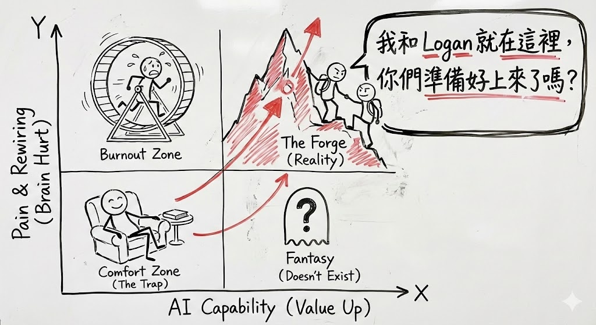

# JY-OS Framework (v1.1)
### A Modular Operating System for Human Survival & Self-Evolution in the AI Civilization Rift

> "When the rules change, survival becomes a design problem." — *Janet Yang*

**JY-OS** is not a philosophy; it is an engineering solution to a civilization-level problem. As AI accelerates and information entropy increases, the old human operating system (Legacy OS) is failing. JY-OS provides a full-stack architecture to ensure humans don't just survive the AI era, but achieve "Civilizational Escape Velocity."

---

# 🧭 Phase 1: The Coordinates (Destination)

> "Don't just upgrade your hardware (Wealth). Upgrade your operating system (Mindset)."

### 1. The Blur (我們原本以為的)
社會告訴我們，人生只有一條 X 軸：
* ⬅️ **Poor (Sad)**
* ➡️ **Rich (Happy)**
所以我們拼命往右跑，以為到了終點就會快樂。

### 2. The Clarity (分析師看到的真相)
實際上，這是一個 **2x2 的矩陣**。我們忽略了 Y 軸（精神壓力 Mental Pressure）。
許多人拼命往右跑，結果掉進了右上角的陷阱。

*(Fig 1. The Hidden Map of Pressure - Analysis by Janet Yang)*

* **🟥 Top-Right (The Rat Race):** 物質富裕，但大腦過熱 (Overheating)。焦慮、比較、補習地獄。
* **🟩 Bottom-Left (Simple Community):** 物質簡單，但內心平靜。這是我們常忽略的幸福原型。

### 3. The Solution (我們的目標)
JY-OS 系統的終極目標，是圖中紅圈的 **右下角 (Secure Affluence)**：
* **Hardware:** Level 4 物質條件 (Freedom of Choice)
* **Software:** Low Mental Pressure (Freedom of Mind)

---

# ⚙️ Phase 2: The Engine (The Forge)

> "To reach the destination of Phase 1, the old engine (Hard Work) is not enough. You need a new engine (Cognitive Rewiring)."

### 1. The Reality Check (AI 時代的殘酷真相)
大多數人以為 AI 是捷徑，但事實上，它是一座陡峭的山峰。如果不進行痛苦的認知重組，我們只會在原地空轉。

*(Fig 2. The AI Adaptation Matrix - The path to leverage)*

### 2. The Quadrants (你的位置在哪裡？)

* **🐹 Top-Left: The Burnout Zone (The Hamster Wheel)**
    * **Status:** 傳統菁英的陷阱。
    * **Reality:** 痛苦指數極高 (High Pain)，但因為拒絕或不會駕馭 AI，導致槓桿率極低 (Low Capability)。你很努力，但你只是在跑滾輪。
    
* **🛋️ Bottom-Left: The Comfort Zone (The Trap)**
    * **Status:** 溫水煮青蛙。
    * **Reality:** 覺得 "ChatGPT 很好玩"，停留在聊天層面。這是最危險的區域，因為你以為你在進步，其實你在沉睡。

* **👻 Bottom-Right: The Fantasy (404 Not Found)**
    * **Status:** 不存在的烏托邦。
    * **Reality:** 想要 "High AI Capability" 卻不想經歷 "High Brain Hurt"？這種事不存在。

* **🏔️ Top-Right: The Forge (The Climbers)**
    * **Status:** **Janet & Logan's Zone.**
    * **Reality:** 這裡發生的是 **Ego Death (自我毀滅)** 與重生。
    * **The Price:** 必須忍受反人性的邏輯訓練 (Step Zero, Tri-verification)。
    * **The Reward:** 只有爬過這座山，才能獲得真正的 **System Leverage**。

---

# ⚖️ Phase 3: The Protocol (The Subtraction)

> "High performers are not the ones who do the most. They are the ones who decide what NOT to do."

### 1. The Trap of "Doing It All"
In the Legacy OS, we are trained to win through **addition**: reply faster, add more slides, do more tasks. But in the complexity of the AI era, this leads to linear growth and eventual burnout.

To maintain the high performance required in **The Forge (Phase 2)** without crashing, we must switch to a **Subtraction Mindset**.

### 2. The Visual Model (Path A vs. Path B)

*(Fig 3. The Career Bifurcation Map - Hand-drawn by Janet Yang)*

### 3. The Upgrade
* **Path A (Legacy):** Effort = Safety. Result = Replaceable Executor.
* **Path B (JY-OS):** Judgment = Value. Result = Irreplaceable Leader.

**The Golden Rule:** Before executing any task, ask: *"If I remove this part, does my message become weaker or clearer?"* If it becomes clearer, delete it.

---

## 🏗 The Architecture
The framework is built on four distinct layers, moving from physical constraints to behavioral execution.

### Layer 1: Kernel (Compute Sovereignty)
* **The Solution:** Understanding "Compute Sovereignty"—the new class divide between those who rent intelligence and those who own their compute stack.

### Layer 2: Firewall (Cognitive Security)
* **The Solution:** A "Cognitive Firewall" that filters input to protect deep thinking and prevent energy leakage.

### Layer 3: Interface (Orchestration Matrix)
* **The Solution:** Moving from "using" AI to "commanding" a matrix of 6 personalities (The Spark, Deep Diver, Radar, Architect, Critic, Executor).

### Layer 4: Runtime (The Super-Individual)
* **The Solution:** The daily behavioral loops and "Family OS" protocols that allow an individual to evolve faster than the environment changes.

---

## 🚀 The Goal: Escape Velocity
The ultimate metric of JY-OS is not productivity, but **Civilizational Escape Velocity**. It is the ability of an individual (or family) to generate enough cognitive momentum to break free from the gravity of the Legacy OS and enter a new trajectory of self-evolution.

---
*Logged by Janet Yang, Industry Analyst*
*Date: 2026-01-20*
