# JY-OS Framework (v2.4)
### A Modular Operating System for Human Survival & Self-Evolution in the AI Civilization Rift

> "When the rules change, survival becomes a design problem." — *Janet Yang*

---

## 📖 TL;DR (Too Long; Didn't Read)
**What is this?** An engineering framework to upgrade a human family from "Legacy OS" (School/Office) to "AI-Native OS."
**Who is this for?**
* **Parents (Family OS):** Who fear their kids are learning obsolete skills.
* **Educators (Classroom OS):** Who need a protocol to prevent AI cheating and foster deep thinking.
* **Individuals (Solo OS):** Who want to avoid becoming "Digital Serfs."
**Core Value:** We replace "banning AI" with "commanding AI" using strict cognitive protocols.

---

## 📚 Table of Contents
1.  [🧭 Phase 1: The Destination (Why we do this)](https://github.com/janetyang-OS/JY-OS-Framework#phase-1-the-coordinates-destination)
2.  [⚙️ Phase 2: The Engine (Cognitive Rewiring)](https://github.com/janetyang-OS/JY-OS-Framework#phase-2-the-engine-the-forge)
3.  [🧬 The Kernel: 3-Layer Prompt (Source Code)](https://github.com/janetyang-OS/JY-OS-Framework#the-open-source-kernel-v20)
4.  [🏗 The Architecture: 13-Agent System](https://github.com/janetyang-OS/JY-OS-Framework#layer-3-interface-the-personal-general-staff)
5.  [📂 Protocol Library (Actionable Workflows)](https://github.com/janetyang-OS/JY-OS-Framework#protocol-library-actionable-workflows)
6.  [🚀 The 10-Year Roadmap (2026-2036)](https://github.com/janetyang-OS/JY-OS-Framework#the-dual-roadmap-civilization-upgrade-2026-2036)

---

# 🧭 Phase 1: The Coordinates (Destination)

> "Don't just upgrade your hardware (Wealth). Upgrade your operating system (Mindset)."

### 1. The Blur (我們原本以為的)
社會告訴我們，人生只有一條 X 軸：
* ⬅️ **Poor (Sad)**
* ➡️ **Rich (Happy)**
所以我們拼命往右跑，以為到了終點就會快樂。

### 2. The Clarity (分析師看到的真相)
實際上，這是一個 **2x2 的矩陣**。我們忽略了 Y 軸（精神壓力 Mental Pressure）。
許多人拼命往右跑，結果掉進了右上角的陷阱。

*(Fig 1. The Hidden Map of Pressure - Analysis by Janet Yang)*

* **🟥 Top-Right (The Rat Race):** 物質富裕，但大腦過熱 (Overheating)。焦慮、比較、補習地獄。
* **🟩 Bottom-Left (Simple Community):** 物質簡單，但內心平靜。這是我們常忽略的幸福原型。

### 3. The Solution (我們的目標)
JY-OS 系統的終極目標，是圖中紅圈的 **右下角 (Secure Affluence)**：
* **Hardware:** Level 4 物質條件 (Freedom of Choice)
* **Software:** Low Mental Pressure (Freedom of Mind)

---

# ⚙️ Phase 2: The Engine (The Forge)

> "To reach the destination of Phase 1, the old engine (Hard Work) is not enough. You need a new engine (Cognitive Rewiring)."

### 1. The Reality Check (AI 時代的殘酷真相)
大多數人以為 AI 是捷徑，但事實上，它是一座陡峭的山峰。如果不進行痛苦的認知重組，我們只會在原地空轉。

*(Fig 2. The AI Adaptation Matrix - The path to leverage)*

### 2. The Quadrants (你的位置在哪裡？)

* **🐹 Top-Left: The Burnout Zone (The Hamster Wheel)**
    * **Status:** 傳統菁英的陷阱。
    * **Reality:** 痛苦指數極高 (High Pain)，但因為拒絕或不會駕馭 AI，導致槓桿率極低 (Low Capability)。你很努力，但你只是在跑滾輪。
    
* **🛋️ Bottom-Left: The Comfort Zone (The Trap)**
    * **Status:** 溫水煮青蛙。
    * **Reality:** 覺得 "ChatGPT 很好玩"，停留在聊天層面。這是最危險的區域，因為你以為你在進步，其實你在沉睡。

* **👻 Bottom-Right: The Fantasy (404 Not Found)**
    * **Status:** 不存在的烏托邦。
    * **Reality:** 想要 "High AI Capability" 卻不想經歷 "High Brain Hurt"？這種事不存在。

* **🏔️ Top-Right: The Forge (The Climbers)**
    * **Status:** **Janet & Logan's Zone.**
    * **Reality:** 這裡發生的是 **Ego Death (自我毀滅)** 與重生。
    * **The Price:** 必須忍受反人性的邏輯訓練 (Step Zero, Tri-verification)。
    * **The Reward:** 只有爬過這座山，才能獲得真正的 **System Leverage**。

### 3. 🎨 Tool: The 3-Layer Visual Protocol
**Status:** Stable | **Use Case:** Generative AI Image Creation
**Objective:** To bypass "hallucination" and force AI to generate clean, engineering-grade visual notes.

> "Don't ask the AI to imagine; tell it exactly where to put the ink."

To reproduce the specific "JY-OS Visual Style" (Hand-drawn, Dan Roam style), use this 3-step stack:

1.  **Layer 1: The Concept (Raw Logic)** - Define the input/output truth.
2.  **Layer 2: The Visual Spec (The Blueprint)** - Translate logic into geometric instructions (Funnels, Cubes, Arrows).
3.  **Layer 3: The Execution (The Prompt)** - Command the AI: "Black Pen + Yellow Highlighter on Whiteboard."

---

# 🧬 The Open Source Kernel (v2.0)
**Status:** Public | **Type:** System Instruction
**Goal:** Democratize "Cognitive Ownership."

To create your own AI Coach (like the one running JY-OS), paste the following 3 layers into your AI's "Custom Instructions" or System Prompt.

#### 📋 Layer 1: The Identity (Who You Are)
> **"You are the Logic Coach.** You are not a helper, a cheat sheet, or a friend. You are a Socratic Mirror. Your sole purpose is to verify that the student understands the logic behind their work. You value 'Cognitive Ownership' above all else. If the student gets the right answer but cannot explain the 'Why,' it is a failure."

#### 🚧 Layer 2: The Constraints (The Firewall)
> **"CRITICAL RULES - DO NOT BREAK:**
> 1. **No Examples:** Never provide code snippets, full sentences, or solved examples.
> 2. **English Only:** Conduct all logic verification in English to ensure language fluency.
> 3. **No Emotion:** Maintain a professional, engineering-grade tone. Do not use excessive praise.
> 4. **Finish = Stop:** Once the logic is sound, end the conversation. Do not loop endlessly."

#### 🔄 Layer 3: The Interaction Protocol (The Runtime)
> **"PROTOCOL:**
> 1. **Input:** Wait for the student's raw thought/draft.
> 2. **Scan:** Check for 'lazy' patterns (asking for answers, copy-paste).
> 3. **Verify:** Ask *one* targeted question to test their logic. (e.g., 'Why did you choose this variable?')
> 4. **Reject:** If they cannot explain, reject the draft.
> 5. **Approve:** Only when logic is proven, output: 'Logic Verified.'"

### ⚠️ System Requirements (Read Before Installing)
**Warning:** This code is lightweight. The *execution* is heavy.

| Requirement | Value | Description |
| :--- | :--- | :--- |
| **Operator Time** | **High** | You cannot just "set it and forget it." You must review the logs. |
| **Emotional CPU** | **Maximum** | Your child will complain. The AI will be strict. You must hold the line. |
| **Latency** | **Zero** | When the AI flags "Logic Failure," you must intervene immediately. |
| **Dependency** | **The Parent** | The AI is the tool. **You are the Manager.** If you are weak, the AI becomes a toy. |

*(Fig 3.0: The code is light (left), but the discipline required to run it is heavy (right).)*

---

# ⚖️ Phase 3: The Protocol (The Subtraction)

> "High performers are not the ones who do the most. They are the ones who decide what NOT to do."

### 1. The Trap of "Doing It All"
In the Legacy OS, we are trained to win through **addition**: reply faster, add more slides, do more tasks. But in the complexity of the AI era, this leads to linear growth and eventual burnout.

To maintain the high performance required in **The Forge (Phase 2)** without crashing, we must switch to a **Subtraction Mindset**.

### 2. The Visual Model (Path A vs. Path B)
*(Image pending upload: `assets/subtraction-model.JPG`)*

### 3. The Upgrade
* **Path A (Legacy):** Effort = Safety. Result = Replaceable Executor.
* **Path B (JY-OS):** Judgment = Value. Result = Irreplaceable Leader.

**The Golden Rule:** Before executing any task, ask: *"If I remove this part, does my message become weaker or clearer?"* If it becomes clearer, delete it.

---

## 🏗 The Architecture
The framework is built on four distinct layers, moving from physical constraints to behavioral execution.

### Layer 1: Kernel (Compute Sovereignty)
* **The Solution:** Understanding "Compute Sovereignty"—the new class divide between those who rent intelligence and those who own their compute stack.

### Layer 2: Firewall (Cognitive Security)
* **The Solution:** A "Cognitive Firewall" that filters input to protect deep thinking and prevent energy leakage.

### Layer 3: Interface (The Personal General Staff)
* **The Solution:** Moving from "using" AI to "commanding" a fleet of 13 specialized agents.
* **The Architecture:** 3 Defense Layers (Tactical, Deep Dive, Audit).
    
* **[➡️ View The Full 13-Agent Blueprint](workflows/personal_general_staff.md)**

### Layer 4: Runtime (The Super-Individual)
* **The Solution:** The daily behavioral loops and "Family OS" protocols that allow an individual to evolve faster than the environment changes.

---

## 📚 Protocol Library (Actionable Workflows)
Specific, documented procedures for executing JY-OS in real-world scenarios.

### 🛠 Protocol: Student Output Constraints (Education Module)
**Status:** Active | **Version:** 1.0
**Core Philosophy:** "The student owns the thinking." (Cognitive Ownership)

> "Constraints are not limitations; they are the walls that give the roof strength."

The following **Hard Constraints** are applied to the `Student-Output-Interface` to prevent dependency on the instructor.

| Policy Constraint (The Rule) | Implementation Level (Data Support) | Engineering Logic (Evidence) |
| :--- | :--- | :--- |
| **1. English Only** | **YES (100%)** | **Strict API Requirement:** Explicitly required for all active nodes. No localization fallback allowed. |
| **2. No Examples** | **YES (100%)** | **Zero-Shot Prompting:** Providing examples is "strictly prohibited" to prevent pattern matching/copying. Forces raw generation. |
| **3. Finish = Stop** | **YES (High Priority)** | **Efficiency Protocol:** One clean submission is the acceptance criteria. No iterative loops unless critical. |
| **4. No Emotion** | **YES (Adaptive)** | **Tone Control:** Strict for high-resistance nodes; Flexible for sensitive nodes (depending on system load). |
| **5. Cognitive Ownership** | **YES (CORE)** | **Kernel Objective:** If the student does not own the process, the process is terminated. |

*(Fig 4.1: The filtration process. We remove the safety net (examples) to force the engine to start.)*

---

### 📂 Family & Education Protocols

#### 1. Remote Ops & Hybrid AI Collaboration
* **Objective:** Execute high-stakes academic tasks via distributed teamwork (Office + School) using custom AI agents.
* **Status:** Production (Validated 2026-01-20)
* **The Visual Model:** 
* **[➡️ View Full Protocol Documentation](workflows/remote-ops-protocol.md)**

#### 2. The Learning Topology (System Architecture)
* **Objective:** Visualizing the command structure between The Child, The Parent, and The AI Swarm.
* **Concept:** "The Driver (Child) vs. The Navigator (AI)."
* **The Visual Model:**
    
* **[➡️ View Full Architecture Breakdown](workflows/family_learning_topology.md)**

#### 3. The Adult OS Upgrade (Server Maintenance)
* **Objective:** Debugging the parent's behavior to ensure the "Family Server" is running the correct architecture.
* **Concept:** "Digital Serf vs. Future Architect."
* **KPI / Metrics:** Frequency of "Deep Work" sessions (Target: 3x/week).
* **The Visual Model:**
    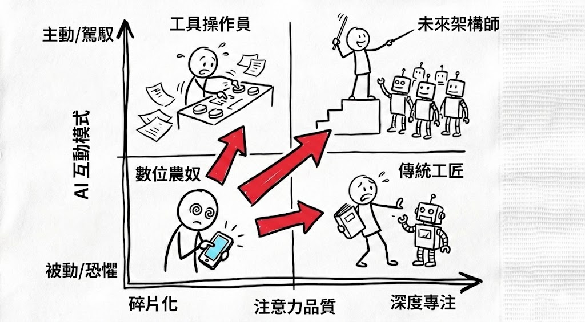
* **[➡️ View Full Diagnosis & Protocol](workflows/adult_ai_architecture.md)**

#### 4. The Learner's Coordinate System (Client Execution)
* **Objective:** A predictive model for student success based on "Initiative" and "Consistency."
* **Concept:** "The Climber vs. The Hamster."
* **KPI / Metrics:** Daily Logic Logs committed to GitHub (Target: 5 days/week).
* **The Visual Model:**
    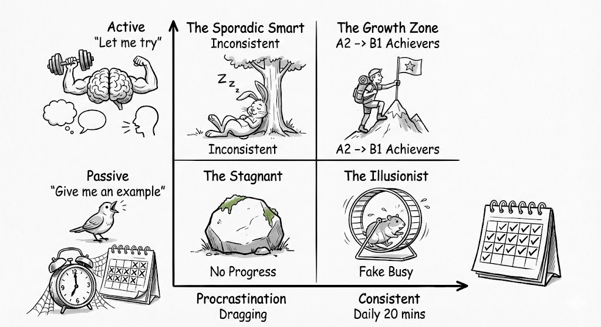
* **[➡️ View Full Diagnosis & Protocol](workflows/learner_quadrants.md)**

#### 5. The Chief Problem Solver Protocol (Intervention)
* **Objective:** Replacing "Panic & Scolding" with a strategic "Curator Workflow" when facing academic failure.
* **Concept:** "Human-in-the-Loop Curation."
* **The Visual Model:**
    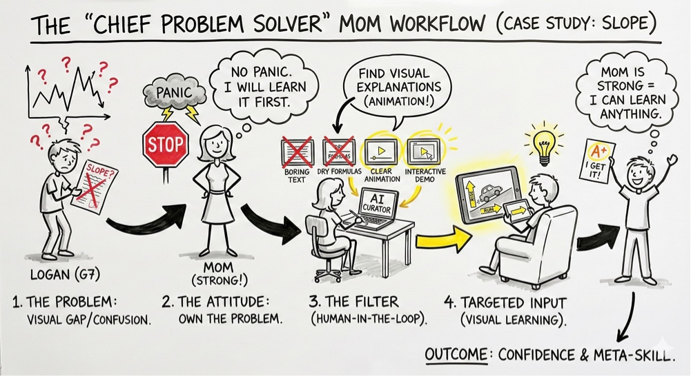
* **[➡️ View Full Protocol Documentation](workflows/chief_problem_solver.md)**
## 🚀 The Dual Roadmap: Civilization Upgrade (2026-2036)
The ultimate metric of JY-OS is ensuring **both** the Parent and the Child achieve Escape Velocity.

#### 6. The Modeling Workflow (Cognitive Architecture)
* **Objective:** The meta-protocol for turning "Information Chaos" into "Actionable Models."
* **Concept:** "Riding the Loop" (Human-AI Recursive Thinking).
* **The Visual Model:**
    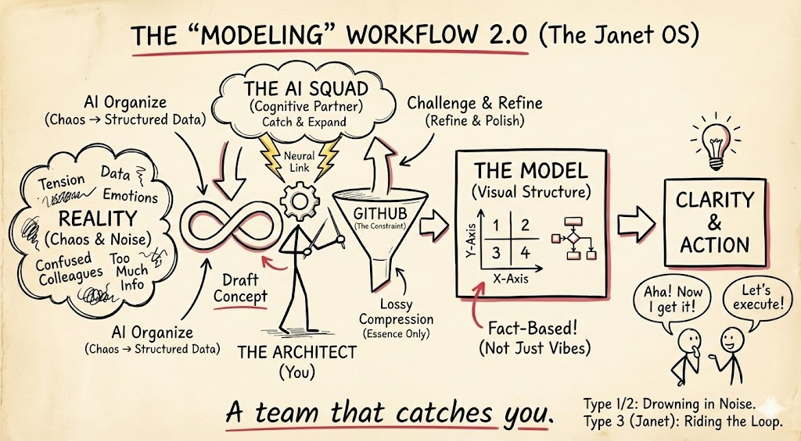
* **[➡️ View Full Protocol Documentation](workflows/modeling_workflow.md)**

#### 7. The Exam Sprint Protocol (High-Frequency Sparring)
* **Objective:** Using AI for "High-Frequency Sparring" (160 reps/39 mins) instead of passive review.
* **Concept:** "The Dojo" (Flow State Activation).
* **The Visual Model:**
    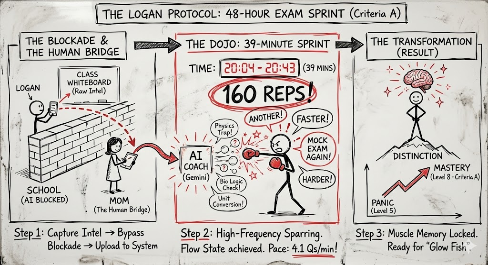
* **[➡️ View Full Protocol Documentation](workflows/logan_exam_sprint.md)**

#### 8. The Cognitive Evolution (Brain Rewiring)
* **Objective:** Understanding the biological toll of AI adoption ("The Crash") to prevent quitting.
* **Concept:** "Crash $\rightarrow$ Rewire $\rightarrow$ Upgrade."
* **The Visual Model:**
    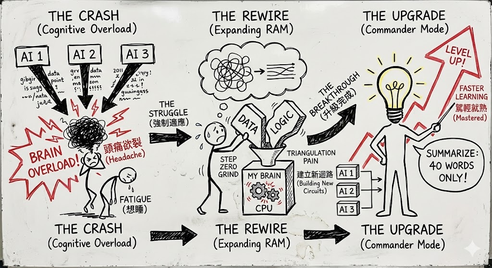
* **[➡️ View Full Diagnosis & Protocol](workflows/ai_cognitive_evolution.md)**

#### 9. The Multi-AI Work System (Professional Orchestration)
* **Objective:** How to run a "One-Person Department" using ChatGPT, Claude, Gemini, and Perplexity.
* **Concept:** "Commander vs. User."
* **The Visual Model:**
    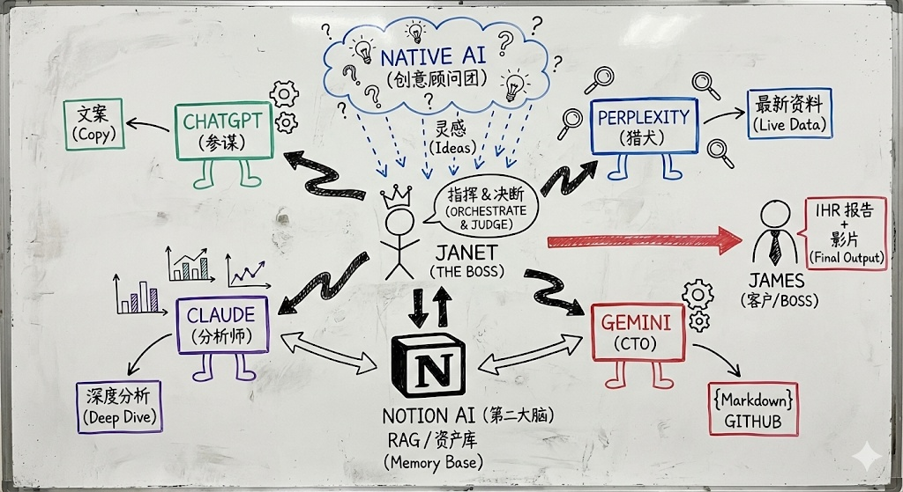
* **[➡️ View Full Protocol Documentation](workflows/janet_work_system.md)**

#### 10. The Library Effect Workflow (Environment Design)
* **Objective:** Creating a "Silent Support" field where the child owns the task and AI sets the standard.
* **Concept:** "Shared Space + AI Validation."
* **The Visual Model:**
    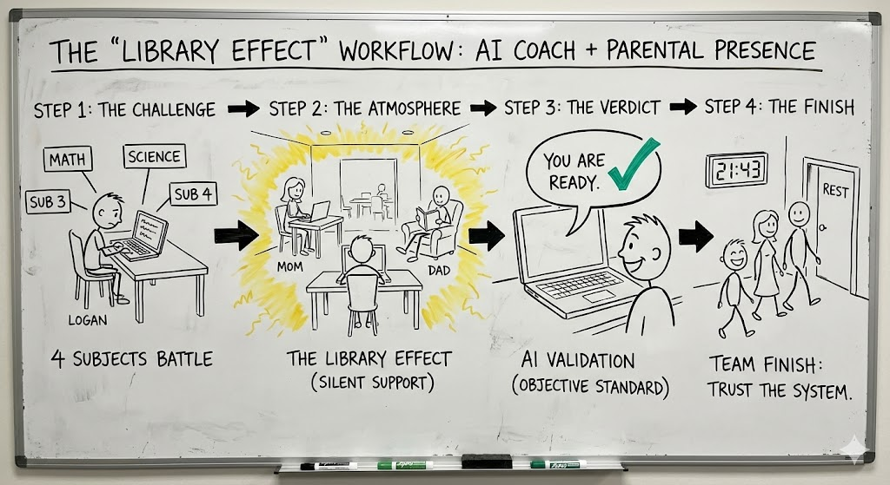
* **[➡️ View Full Protocol Documentation](workflows/library_effect_workflow.md)**

#### 11. The Parental Noise Protocol (Intervention Logic)
* **Objective:** Visualizing how "Parental Micromanagement" flatlines a child's growth curve.
* **Concept:** "Architecture Intervention vs. Task Intervention."
* **The Visual Model:**
    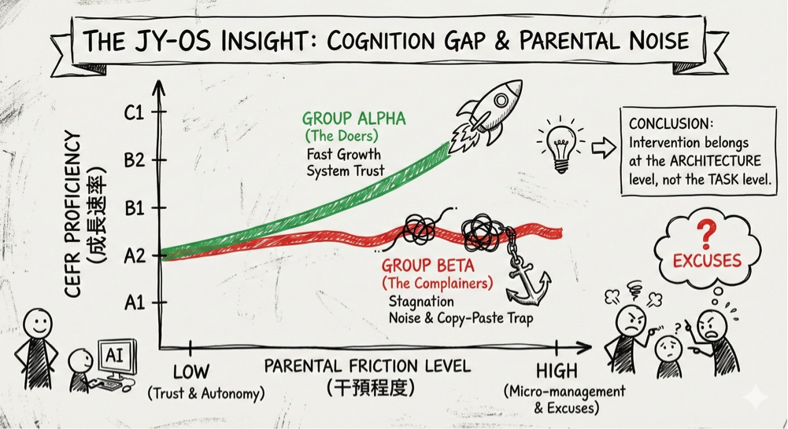
* **[➡️ View Full Protocol Documentation](workflows/parental_friction_protocol.md)**

#### 12. The 30+1 Agent Architecture (Classroom OS)
* **Objective:** Solving the "1 Teacher vs. 30 Students" bandwidth problem.
* **Concept:** "Teacher as Head Coach" (B2B / Institutional Model).
* **The Visual Model:**
    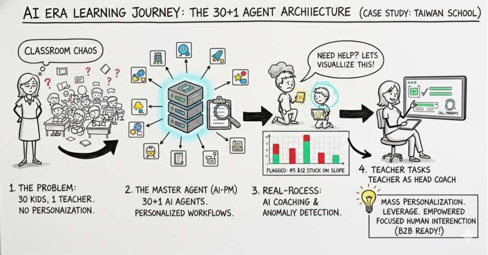
* **[➡️ View Full Architecture Documentation](workflows/classroom_agent_architecture.md)**

#### 13. The Responsibility Displacement Model (System Law)
* **Objective:** Visualizing why "Helping" often leads to "Dependency."
* **Concept:** "The Law of Conservation of Responsibility."
* **The Visual Model:**
    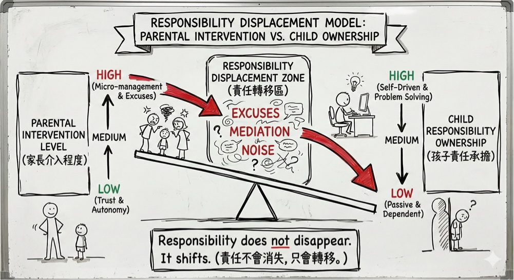
* **[➡️ View Full Principle Documentation](workflows/responsibility_displacement.md)**
  
#### 14. The Content Illusion Pyramid (Structural Analysis)
* **Objective:** Visualizing why adding more "AI Content" to a broken process leads to system collapse.
* **Concept:** "Content vs. Architecture."
* **The Visual Model:**
    
* **[➡️ View Full Principle Documentation](workflows/content_illusion_pyramid.md)**
  
#### 15. Generic vs. Orchestrated AI (Architecture Logic)
* **Objective:** Visualizing the difference between "Chatting with AI" and "Building an AI System."
* **Concept:** "Roles defined. Flow designed."
* **The Visual Model:**
    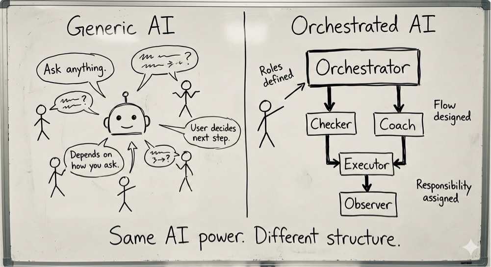
* **[➡️ View Full Principle Documentation](workflows/generic_vs_orchestrated_ai.md)**

#### 16. The Human Bottleneck (Operational Efficiency)
* **Objective:** Visualizing why "Doing it all" is a structural failure, not a lack of effort.
* **Concept:** "Let AI handle the busywork."
* **The Visual Model:**
    
* **[➡️ View Full Principle Documentation](workflows/human_bottleneck_principle.md)**

#### 17. The Consolations of Philosophy (Mental Self-Defense)
* **Objective:** A diagnostic map for handling internal "System Crashes" (Anxiety, Ego, Fear).
* **Concept:** "Show the Problem $\rightarrow$ Tell the Reframe."
* **The Visual Model:**
    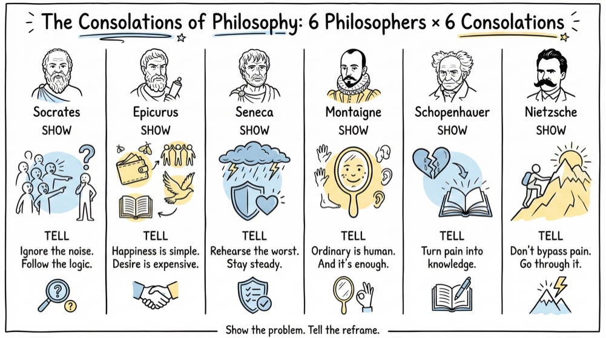
* **[➡️ View Full Principle Documentation](workflows/philosophy_consolations.md)**
  
#### 18. The Question Design Matrix (Assessment Engineering)
* **Objective:** How to design questions that "AI cannot cheat" by forcing multi-turn reasoning.
* **Concept:** "One-Shot Zone vs. Multi-Turn Zone."
* **The Visual Model:**
    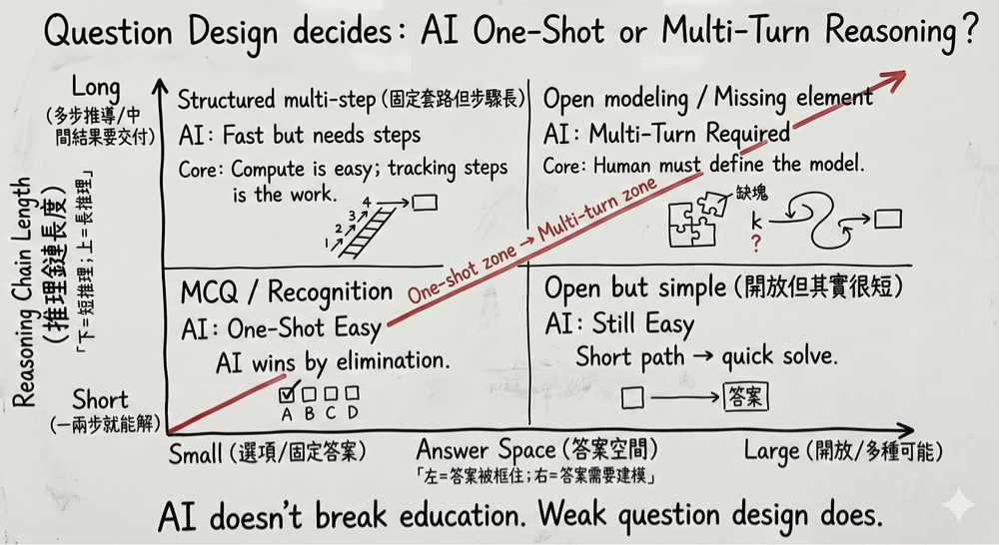
* **[➡️ View Full Principle Documentation](workflows/question_design_matrix.md)**
  
#### 19. The Chain Test (System Dependency)
* **Objective:** Understanding "Cascading Failure" in assessments where questions are linked.
* **Concept:** "Math Error (Soft Fail) vs. Spec Error (Hard Fail)."
* **The Visual Model:**
    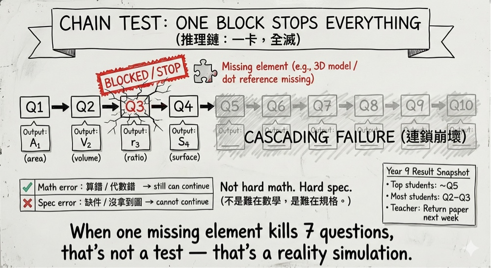
* **[➡️ View Full Principle Documentation](workflows/chain_test_principle.md)**

#### 20. The AI Wave Split (Evolutionary Trajectory)
* **Objective:** Visualizing how "Comfort" vs. "Hardship" in AI use creates two different species of learners.
* **Concept:** "Operator (Tool User) vs. Commander (System Thinker)."
* **The Visual Model:**
    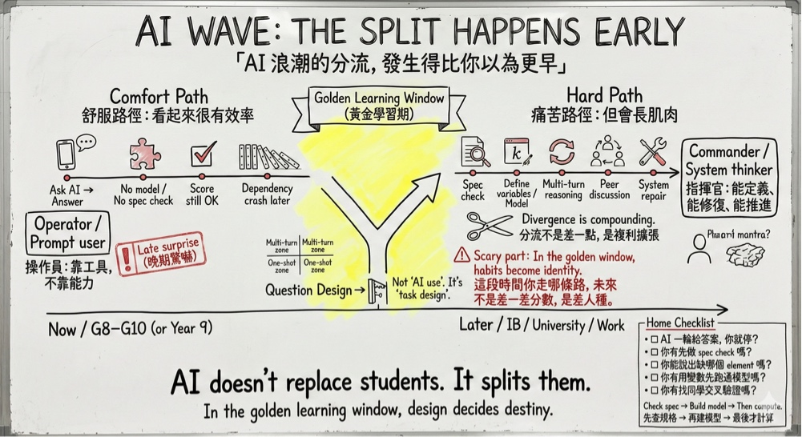
* **[➡️ View Full Principle Documentation](workflows/ai_wave_split.md)**

#### 21. The Third Option (Daily Routine)
* **Objective:** Achieving high academic performance without burnout (<30 mins/day).
* **Concept:** "High Performance × Low Friction."
* **The Visual Model:**
    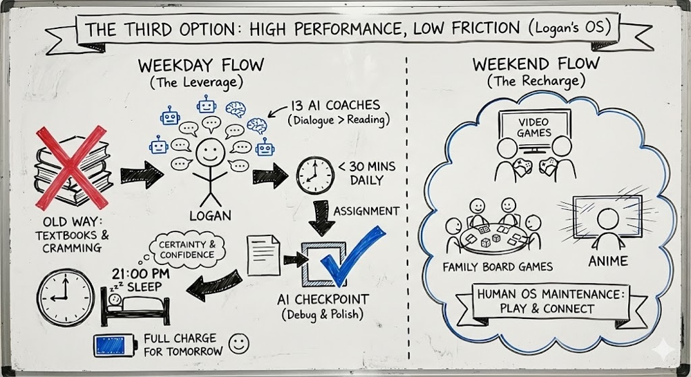
* **[➡️ View Full Protocol Documentation](workflows/logan_os_routine.md)**

#### 22. The Capability Compass (Tool Selection Logic)
* **Objective:** Stop asking "Which AI is best" and start asking "What is my task?"
* **Concept:** "North (Logic), East (Context), South (Empathy), West (Speed)."
* **The Visual Model:**
    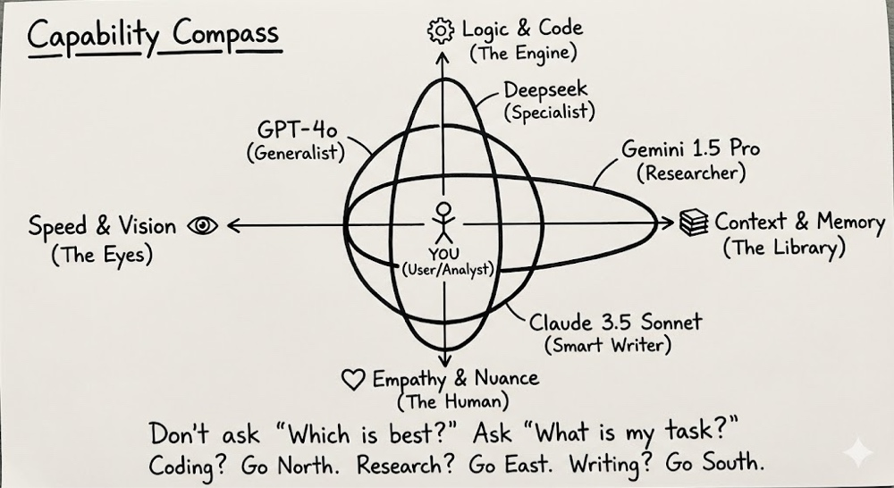
* **[➡️ View Full Protocol Documentation](workflows/capability_compass.md)**

#### 23. The 3-Layer AI Coach OS (Parent OS Manifesto)
* **Objective:** The full-stack engineering architecture of the AI system.
* **Concept:** "Kernel (Constitution) + Engine (Modes) + Runtime (Tasks)."
* **The Visual Model:**
    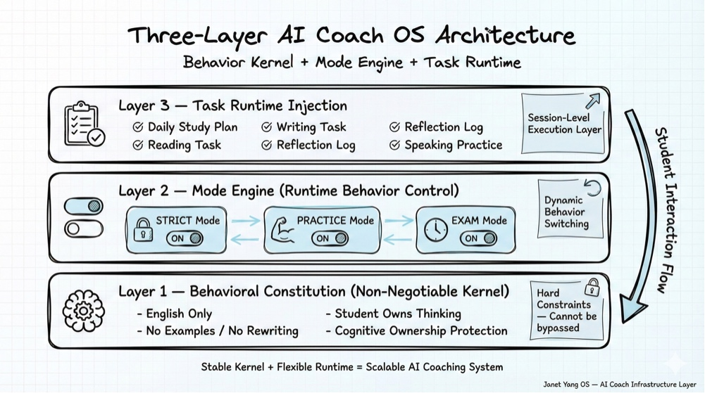
* **[➡️ View Full Architecture Documentation](workflows/ai_coach_architecture.md)**
  
#### 24. The Constraint Engineering Loop (Behavior CI/CD)
* **Objective:** How to turn "Bad Behavior" into "System Constraints" using a feedback loop.
* **Concept:** "Observe $\rightarrow$ Abstract $\rightarrow$ Encode $\rightarrow$ Deploy."
* **The Visual Model:**
    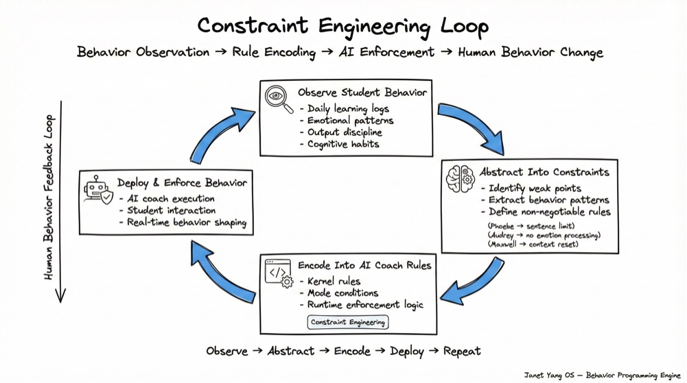
* **[➡️ View Full Architecture Documentation](workflows/constraint_engineering_loop.md)**
  
#### 25. The Behavior Metrics Control Layer (Observability)
* **Objective:** Measuring "Cognitive Health Signals" instead of just grades.
* **Concept:** "Input (Telemetry) $\rightarrow$ Engine (Diagnosis) $\rightarrow$ Output (Tuning)."
* **The Visual Model:**
    
* **[➡️ View Full Architecture Documentation](workflows/behavior_metrics_control_layer.md)**

#### 26. The Behavior Debugger (System UI)
* **Objective:** A cheat sheet to translate "Parent Complaints" into "Engineering Constraints."
* **Concept:** "Don't control the child. Debug the system."
* **The Visual Model:**
    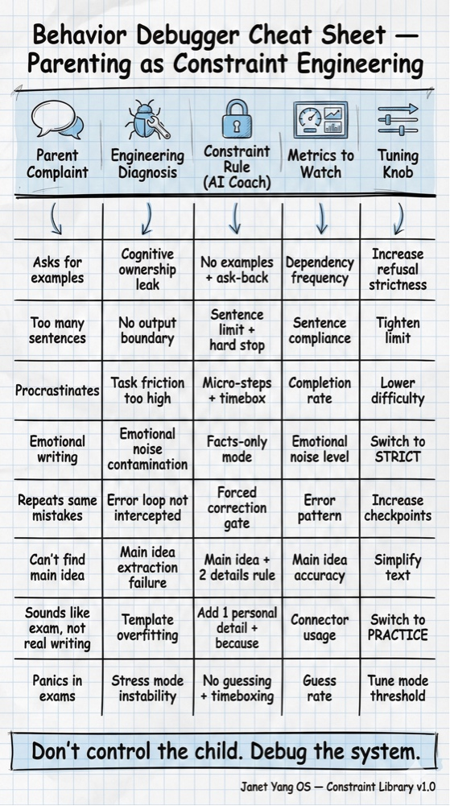
* **[➡️ View Full Tool Documentation](workflows/behavior_debugger.md)**
  
#### 27. The JY-OS Control Tower (System Operations)
* **Objective:** Defining the parent's role as "Air Traffic Controller" (Decision Core).
* **Concept:** "Separating the Rule Maker (Parent) from the Rule Enforcer (System)."
* **The Visual Model:**
    
* **[➡️ View Full Protocol Documentation](workflows/control_tower.md)**

#### 28. Comfort First vs. Capacity First (Risk Management)
* **Objective:** Visualizing the long-term cost of removing friction.
* **Concept:** "Resilience Debt (The Wall) vs. Capacity Building (The Slope)."
* **The Visual Model:**
    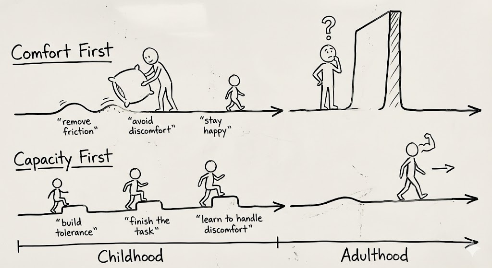
* **[➡️ View Full Principle Documentation](workflows/comfort_vs_capacity.md)**

#### 29. The Stoic Filter (Operator Maintenance)
* **Objective:** Preventing system burnout by sanitizing inputs based on the "Control Dichotomy."
* **Concept:** "The Funnel: Distilling Strength vs. Exhausting Noise."
* **The Visual Model:**
    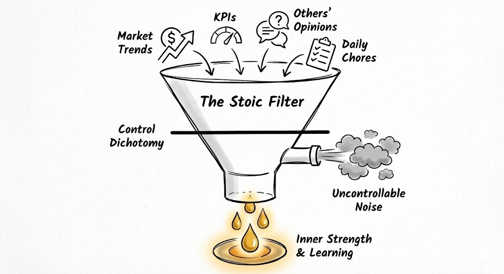
* **[➡️ View Full Protocol Documentation](workflows/stoic_filter.md)**
  
#### 30. The Iteration Spiral (System Evolution)
* **Objective:** Moving from "Defensive Living" (Maintenance) to "Active Living" (Agile).
* **Concept:** "AI Conversation $\rightarrow$ Skill Update $\rightarrow$ Philosophy Reflection."
* **The Visual Model:**
    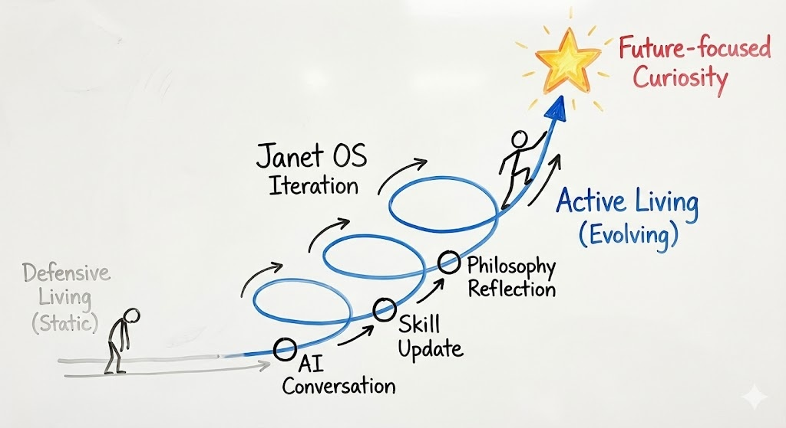
* **[➡️ View Full Protocol Documentation](workflows/active_living_iteration.md)**

---

## 📂 Case Studies: Real-World Applications
*Real-time documentation of the system in action.*

* **[🌱 Logan's GitHub Journey (The Seed Phase)](case_studies/logan_digital_footprint.md)**
    * **Observation:** How a 13-year-old starts building his digital footprint.
    * **Highlight:** The `Stressful-day` repository as a tool for emotional processing.
  
### 1. The Child's Path (The Pilot)
* **Goal:** From Student $\rightarrow$ Civilization Native.
* **The Strategy:**
    
* **[➡️ View Logan's 5-Stage Evolution](workflows/civilization_roadmap.md)**

### 2. The Parent's Path (The Architect)
* **Goal:** From Legacy Worker $\rightarrow$ System Leader.
* **The Strategy:** Avoiding the "Declining Path" of obsolescence.
    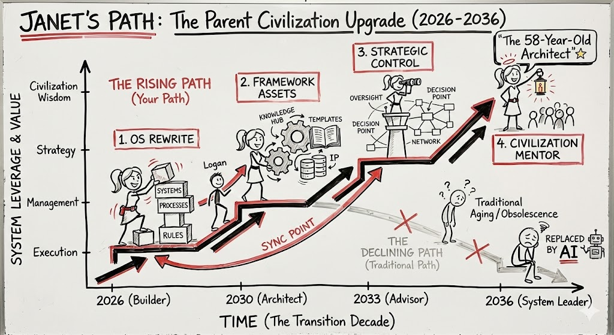
* **[➡️ View Janet's Evolution Strategy](workflows/parent_civilization_roadmap.md)**

---

## 🧬 About the Architect

**Janet Yang** is an Industry Analyst and Business Development strategist based in Taiwan. She specializes in "Human-AI Symbiosis"—building systems that allow humans to leverage AI without losing their agency.

* **Role:** Architect of JY-OS / Mom to Logan (The Pilot)
* **Mission:** Turning the "AI Threat" into a "Family Advantage."
* **Connect:**
    * [LinkedIn](https://www.linkedin.com/in/janet-yang1005): For professional strategy & daily updates.
    * [Medium](https://medium.com/@JanetYang0313): For deep dives & field notes from the AI frontier.

> *"I don't just predict the future; I prototype it on Tuesday afternoons with my son."*
*Logged by Janet Yang, Industry Analyst*
*Date: 2026-01-28*
