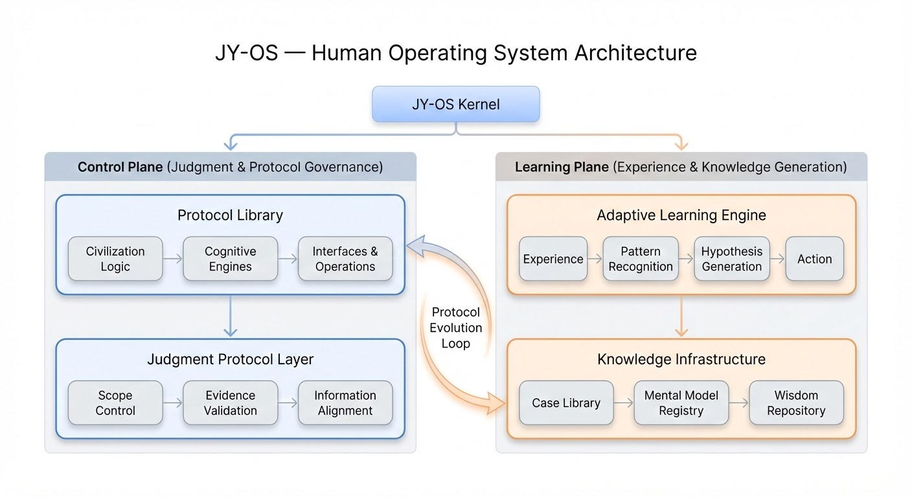

# JY-OS — Human Operating System

## Introduction

JY-OS is a cognitive infrastructure designed to help humans operate effectively in the AI era.

Unlike traditional education systems that focus on knowledge accumulation, JY-OS focuses on **judgment, learning intelligence, and knowledge infrastructure**.

The system treats learning as an operating system composed of protocols, engines, and knowledge infrastructure that continuously evolve through experience.

JY-OS is not designed as a tutoring method or curriculum.

It is an operating framework for human learning systems in the AI era.

---

## Architecture Overview

JY-OS is structured similarly to a modern system architecture, separating **protocol governance** from **learning execution**.

### 1. Kernel Layer

The **JY-OS Kernel** defines the core operating principles of the system.

It governs how judgment protocols, learning engines, and knowledge infrastructure interact.

---

### 2. Control Plane — Judgment & Protocol Governance

The Control Plane ensures the system maintains high-quality reasoning.

**Protocol Library**

- Civilization Logic
- Cognitive Engines
- Interfaces & Operations

**Judgment Protocol Layer**

- Scope Control
- Evidence Validation
- Information Alignment

This layer prevents:

- reasoning drift  
- misinformation  
- uncontrolled inference

---

### 3. Learning Plane — Experience & Knowledge Generation

The Learning Plane is responsible for adaptive learning.

**Adaptive Learning Engine**

---

This engine converts real-world interaction into structured learning.

---

### 4. Knowledge Infrastructure

All validated learning outcomes are stored as reusable knowledge.

Components include:

- Case Library
- Mental Model Registry
- Wisdom Repository

This creates a long-term **knowledge compounding system**.

---

### 5. Protocol Evolution Loop

A key feature of JY-OS is the **Protocol Evolution Loop**.

Knowledge generated by the Learning Plane feeds back into the Control Plane to refine protocols and improve decision-making.

This loop allows the system to continuously evolve.

## 🔬 Real-World Learning Experiment

JY-OS is not only a conceptual framework.

The system is currently being observed in a real learning environment.

Experiment Context

• Learner: Logan (IB student)  
• System Architect / Observer: Janet Yang  
• Learning Environment: AI Coach Staff architecture  

The experiment explores a central question:

Can an AI-assisted learning environment support efficient human learning inside a rigorous academic system?

Observation Period

IB MYP Year 4 (Grade 9) → IB Diploma Programme (Grades 11–12)

The observation follows the student's progression from the IB Middle Years Programme into the IB Diploma Programme.

This period allows longitudinal observation of learning development within a consistent academic framework.

The experiment logs and observations are documented in the repository.

Selected reflections are shared on Medium and LinkedIn, while GitHub stores the underlying evidence and system documentation.

## 🧪 Playbook (Evidence Infrastructure)

This section documents operational evidence generated by the JY-OS learning system.

Rather than theoretical discussion, the playbook captures real workflow patterns:

workflow → evidence → diagnosis → prescription → system improvement

This is where JY-OS becomes **an asset**, not just ideas.  
It documents operational casework: **workflow → evidence → diagnosis → prescription → change**.

### 🔁 Core Loops
- **CAP Daily Loop (12+8 SOP)** — evidence-based reading judgment  
  - [➡️ Open Doc](playbook/reading-judgment/README.md)

- **CAP Judgment Protocol Layer** — structural reasoning protocols used to validate reading decisions  
  - [➡️ Open Doc](playbook/reading-judgment/protocol-layer/README.md)

- **PVUL: Philosophy Validated Understanding Loop** — input → model → practice → student output → diagnosis → fix → **assetization**  
  - [➡️ Open Doc](playbook/philosophy/bridge-to-lab/philosophy-validated-understanding-loop.md)

### 📚 Evidence Library
- **Case Library (Anonymized)** — real student patterns & fixes  
  - [➡️ Open Doc](playbook/case-library/README.md)

- **Case Record Schema** — standard fields for daily logs & case entries  
  - [➡️ Open Doc](playbook/case-library/case-record-schema.md)

- **Error Taxonomy & Fix Library** — diagnostic codes → prescriptions  
  - [➡️ Error Codes](playbook/taxonomy/error-codes.md)  
  - [➡️ Fix Library](playbook/taxonomy/fix-library.md)

- **CHANGELOG** — weekly iteration log (system upgrades)  
  - [➡️ Open Doc](playbook/CHANGELOG.md)

---

## 📂 Protocol Library (系統核心目錄)

### 🛡️ The Civilization Layer (Philosophy)
* **[#42] The 4D Strategy Model** (Career Architecture)
    * *Concept:* Escaping the "1D Ladder" to build "4D Time Compounding."
    * [➡️ View Protocol](workflows/strategy_4d_model.md)
* **[#41] The Human Core** (Civilization Defense)
    * *Concept:* The AI Mirror. Transitioning from "Panic" to "Power" through intentional mastery.
    * [➡️ View Protocol](workflows/Protocol-41-Human-Core.md)
* **[#38] The Founder's Mental Model** (Long-Term Navigation)
    * *Concept:* The J-Curve, Human Anchors, and the "OK State."
    * [➡️ View Protocol](workflows/founder_mental_model.md)
* **[#33] The Civilization Fault Line** (Risk Analysis)
    * *Concept:* The divide between "Consumer" (Red Zone) and "Creator" (Green Zone).
    * [➡️ View Protocol](workflows/civilization_fault_line.md)

### 🧠 The Engine Layer (Cognitive Algorithms)
* **[#39] The Logic Filters** (Critical Thinking Architecture)
    * *Concept:* Truth Verification, Plato's Driver, and Validity Checks.
    * [➡️ View Protocol](workflows/logic_filters.md)
* **[#37] The Learning Engine** (Cognitive Reconstruction)
    * *Concept:* Pattern Recognition & "Step 0" Latency.
    * [➡️ View Protocol](workflows/learning_engine.md)
* **[#30] The Iteration Spiral** (Growth Loop)
    * *Concept:* Rapid prototyping for habits and skills.
    * [➡️ View Protocol](workflows/iteration_spiral.md)

### 🛠️ The Interface Layer (Execution Tools)
* **[#40] The CAP Reading Strategy** (Evidence Workflow — Playbook Core)
    * *Concept:* Evidence-based answering (12+8 SOP → evidence → diagnosis) to fix intuition guessing.
    * [➡️ View Protocol](workflows/exam_reading_protocol.md)
* **[#36] The 13-Agent AI Staff** (Orchestration)
    * *Concept:* A layered AI team (Tactical, Strategy, Audit) for mission support.
    * [➡️ View Protocol](workflows/ai_staff_orchestration.md)
* **[#35] The Environment Protocol** (Spatial Design)
    * *Concept:* Charging Hubs & Public Zones to shape behavior without nagging.
    * [➡️ View Protocol](workflows/environment_protocol.md)
* **[#26] The Behavior Debugger** (Troubleshooting)
    * *Concept:* A cheat sheet to treat conflicts as "System Bugs" not "Moral Failures."
    * [➡️ View Protocol](workflows/behavior_debugger.md)

### 🔋 The Maintenance Layer (System Health)
* **[#34] The Energy Focus Protocol** (Resource Management)
    * *Concept:* Deleting tasks to protect the "Energy Pool."
    * [➡️ View Protocol](workflows/energy_focus.md)
* **[#32] The System State Matrix** (Diagnostics)
    * *Concept:* Identifying if the parent is in "Guardian" or "Terrorist" mode.
    * [➡️ View Protocol](workflows/system_state_matrix.md)

---

## 📥 Quick Resources
* [🖼️ Asset Library (Download all Diagrams)](https://github.com/janetyang-OS/JY-OS-Framework/wiki/Resources-Assets)
* [📄 Cheat Sheets (Printable PDFs)](https://github.com/janetyang-OS/JY-OS-Framework/wiki/Resources-Cheat-Sheets)

## Project Philosophy

JY-OS treats learning as a system architecture problem.

Instead of asking:

"What should students memorize?"

The system asks:

"What cognitive infrastructure allows humans to learn effectively in the AI era?"

*Est. 2024 by Janet Yang*
*Open Source Human Project*
