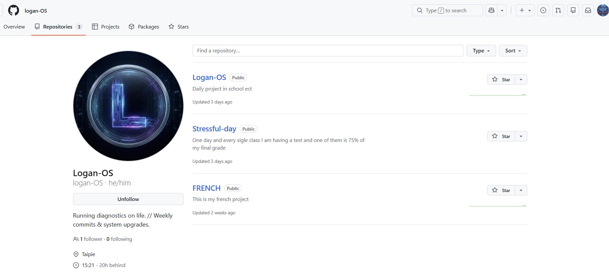

# 🌱 Case Study: The Genesis of Logan-OS (Digital Footprint)
**Subject:** Logan (Year 9) | **Platform:** GitHub | **Stage:** MVP (Minimum Viable Product)

> "Every expert was once a beginner. The most important step is `git init`."

## 📸 The Snapshot: Week 3
This is what the beginning of a digital legacy looks like.

### 📂 The Repositories (The "Artifacts")

#### 1. `Logan-OS`
* **Description:** "Daily project in school ect"
* **Significance:** The realization that his daily life is a "Project" that can be managed. This is the seed of system thinking.

#### 2. `Stressful-day` (My Favorite)
* **Description:** "One day and every single class I am having a test and one of them is 75% of my final grade."
* **Insight:** Logan is using GitHub not just for code, but for **Emotional Documentation**.
    * Instead of just complaining, he created a "Container" for his stress.
    * He defined the parameters of the stress (75% grade).
    * **This is "Objectifying the Problem."**

#### 3. `FRENCH`
* **Description:** "This is my french project"
* **Significance:** Moving academic work from "Google Drive" (Private/Hidden) to "GitHub" (Public/Structured).

---

## 🚀 The "Friday Push" Protocol
**The Habit:** Every Friday, update the repo.
**The Metric:** Consistency > Complexity.

### Why this "Nothing" is actually "Everything"
To the untrained eye, these look like empty folders.
To the Systems Architect, this represents:
1.  **Identity Shift:** From "Consumer" (playing games) to "Creator" (managing repos).
2.  **The Muscle:** He is building the muscle memory of `git add`, `git commit`, `git push`.
3.  **The Archive:** Three years from now, he will look back at `Stressful-day` and smile, seeing how far he has come.

*Logged by Janet Yang*
*The Seed Phase - 2026*
