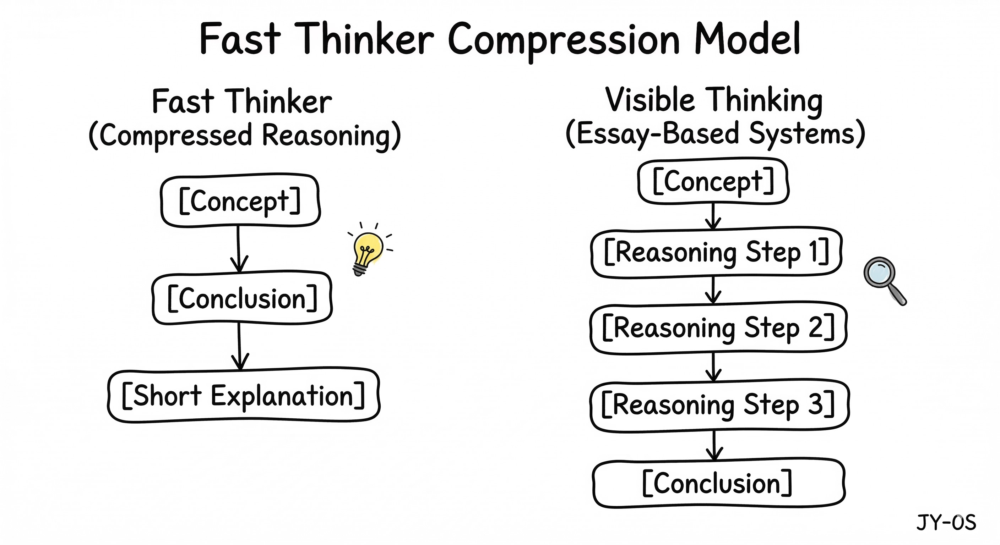

# Reasoning Compression Model

## Concept

Some students reach correct answers quickly but skip intermediate reasoning steps.

This phenomenon is called **reasoning compression**.

The student internally performs multiple reasoning steps, but the written output only shows:

Concept → Conclusion → Short Explanation

This creates a gap between **actual reasoning ability** and **visible reasoning evidence**.

---

## Two Cognitive Modes

### Compressed Reasoning

Concept  
↓  
Conclusion  
↓  
Short Explanation  

Characteristics:
- rapid pattern recognition
- intuitive answer generation
- missing visible reasoning steps

---

### Visible Reasoning

Concept  
↓  
Reasoning Step 1  
↓  
Reasoning Step 2  
↓  
Reasoning Step 3  
↓  
Conclusion  

Characteristics:
- explicit reasoning
- step-by-step argumentation
- evaluable thinking process

---

## Educational Implication

Assessment systems that require explicit reasoning (IB, essay-based exams) may misinterpret compressed reasoning as weak thinking.

Students therefore need training in **externalizing reasoning steps**.

---

## Case Reference

case-001-logan-math-reasoning-gap.md
