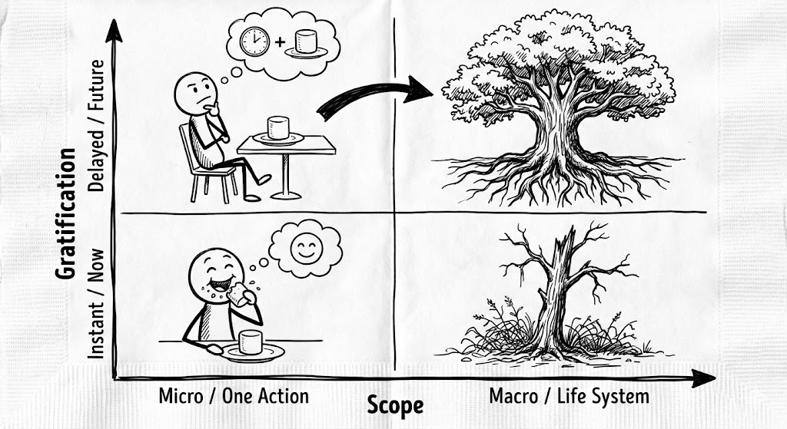

# 🏗 Architecture: The Adult AI Operating System (v1.0)
**Status:** Production | **Target:** The Parent (Server Node)
**Context:** Why adults become busier using AI, and how it impacts the "Client Node" (The Child).

> "AI 在拉開孩子的差距之前，已經先拉開了大人的差距。"

## 📊 The 4 Quadrants of AI Adulthood
This chart maps the "Time Destiny" of adults in the AI era.

*(Fig 1. The Attention vs. Interaction Matrix)*

### The Axes (Coordinates)
* **X-Axis (Attention Quality):** Fragmented (Left) ↔ Deep Focus (Right).
* **Y-Axis (AI Interaction):** Passive Fear (Bottom) ↔ Active Command (Top).

### The 4 Archetypes
| Type | Zone | Behavior Pattern | The Consequence |
| :--- | :--- | :--- | :--- |
| **1. The Digital Serf** | **Bottom-Left** | 每天滑 AI 新聞，焦慮被淘汰，但只被餵食資訊。 | **Result:** No Output. 焦慮感與日俱增。大腦淪為演算法的牧場。 |
| **2. The Traditional Craftsman** | **Bottom-Right** | 拒絕 AI，堅持「純手工」對抗指數級資訊量。 | **Result:** Burnout. 品質很好，但時間被低效流程吃光。 |
| **3. The Tool Operator** | **Top-Left** | 閃亮物體症候群。今天玩 Prompt，明天玩 Agent，沒有主線。 | **Result:** Lost. 產出垃圾內容，在工具切換中迷失目標。 |
| **4. The Future Architect** | **Top-Right** | **The Goal.** 固定時間、固定輸出、固定紀錄 (Log)。 | **Result:** Compound Growth. AI 讓經驗被複利放大。 |

---

## 🔌 The Server-Client Protocol
**Why "Teaching Kids AI" often fails:**
> "家長是伺服器 (Server)，孩子是終端 (Client)。"

* **The Bug:** If the Server is lagging (Parent is a Digital Serf), the Client *must* lag.
* **The Reality:** If you have no "System Logs" (Growth Records), you cannot expect the child to build a model.
* **The Lesson:** Kids do not copy what you say; they execute the code you run daily.

---

## 🌳 The Fractal Effect (Marshmallow vs. Oak)
AI is just a magnifier. It amplifies your existing habits by 10x.

*(Fig 2. Instant Gratification vs. Long-term System Building)*

### The Upgrade Path
To move from "Consumer" to "Architect," implement these 3 protocols immediately:

1.  **Anti-Fragmentation:** Fixed Time Block for deep work.
2.  **Anti-Passivity:** Fixed Output (Don't just read, build).
3.  **Anti-Busywork:** Fixed Review (Weekly Log).

> **"Today's 20-minute focus → A life system in 3 years."**

---

*Logged by Janet Yang*
*Adult OS Diagnosis - 2026*
