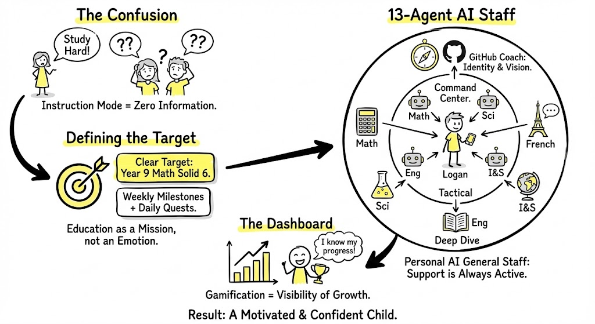

# 🤖 Protocol: The 13-Agent AI Staff (Orchestration)
**Status:** Cognitive Infrastructure | **Role:** General Staff | **Objective:** Mission Support

> "Education as a Mission, not an Emotion. Don't give pressure; give a system."

## 🗺️ The Orchestration Schematic
This diagram illustrates the transition from "Vague Instruction" to "Structured Support."

*(Fig 1. Confusion $\rightarrow$ Target Definition $\rightarrow$ The 13-Agent AI Staff)*

---

## ❓ State 1: The Confusion (Instruction Mode)
**The Bug:** "Study Hard!"
* **The Engineering View:** This is a **Zero Information Command**.
* **Child's Decoder:** "How hard? Until when? Am I failing?"
* **Result:** Stress without a path.

---

## 🎯 State 2: Defining the Target (Mission Mode)
**The Fix:** We convert "Education" into "Mission Specs."
* **From:** "I hope you improve."
* **To:** "Target: Year 9 Math Solid 6."
* **Mechanism:** Weekly Milestones + Daily Quests.
* **The Shift:** Focus moves from *Emotion* (Anxiety) to *Execution* (Tasks).

## 📊 State 3: The Dashboard (Gamification)
**Concept:** Gamification is not about rewards; it is about **Visibility of Growth**.
* **The Metric:** "I know my progress."
* **Result:** Anxiety drops because ambiguity drops.

---

## 🤖 State 4: The 13-Agent AI Staff (The Runtime)
**The Structure:** A Personal AI General Staff.
This is not one chatbot; it is a **Specialized Team**.

### The Command Center 🧠
* **Operator:** Logan (The Child).
* **Role:** Directs the agents. The Human in the Loop.

### The Specialized Agents (Tactical Support)
* **Math AI:** Strategy & Error Analysis.
* **Sci AI:** Concept Deduction.
* **Eng AI:** Structure & Reading Comprehension.
* **I&S AI:** Systems Thinking & Fact Retrieval.
* **French AI:** Language Immersion.

### The Visionary Agent (Strategic Support)
* **GitHub Coach:** Identity, Vision, Long-term Narrative.

---

## 🔗 Integration: Physical + Cognitive
This protocol runs on top of **Protocol #35 (Environment)**.
* **Protocol #35 (Hardware):** Public Zone, Charging Hub. (Prevents "Black Hole").
* **Protocol #36 (Software):** 13-Agent Staff, Mission Specs. (Prevents "Stalling").

> **"Support is Always Active. The child is never stuck alone."**

*Logged by Janet Yang*
*AI Orchestration Log - 2026*
