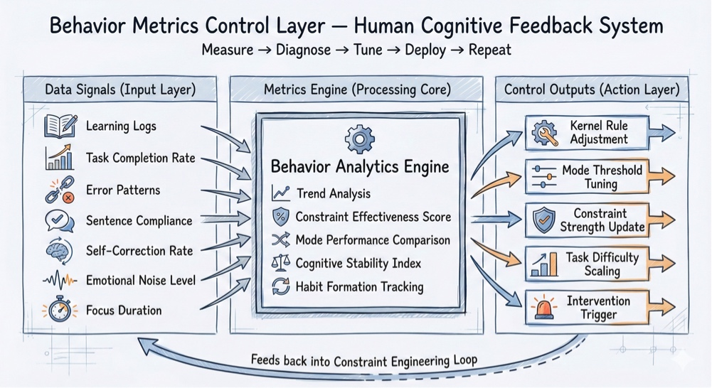

# 🎛️ Architecture: The Behavior Metrics Control Layer (System Observability)
**Status:** Control Plane | **Role:** Data Analyst | **Objective:** From "Guessing" to "Tuning"

> "If you don't measure it, you are just comforting yourself, not engineering the system."

## 🗺 The System Blueprint
This diagram illustrates the feedback mechanism that turns "Parenting" into "Data Science."

*(Fig 1. Inputs (Telemetry) $\rightarrow$ Processing (Diagnosis) $\rightarrow$ Outputs (Tuning))*

---

## 📡 Layer 1: Data Signals (Input Telemetry)
**Goal:** Stop looking at Grades (Lagging Indicators). Start looking at **Cognitive Health** (Leading Indicators).
**The Telemetry Points:**
* **Sentence Compliance:** Is the student respecting the constraint?
* **Self-Correction Rate:** How often do they fix errors without prompting?
* **Error Patterns:** Are they making the *same* mistake repeatedly?
* **Emotional Noise Level:** Is frustration polluting the logic?
* **Focus Duration:** How long until the system crashes?
* **Task Completion Rate:** Can they ship?

---

## 🧠 Layer 2: Metrics Engine (The Processor)
**Goal:** Move from "I feel like he is lazy" to "The data shows a drop in focus duration."
**The Analysis:**
* **Trend Analysis:** Is the self-correction rate improving over 2 weeks?
* **Constraint Effectiveness Score:** Did the "Sentence Limit" rule actually improve clarity?
* **Cognitive Stability Index:** Can they maintain logic under pressure (Exam Mode)?

---

## 🎚️ Layer 3: Control Outputs (The Action)
**Goal:** **"I don't control the child. I control the system."**
Instead of nagging, we adjust the system parameters:
* **Kernel Rule Adjustment:** Do we need to harden the "No Emotion" rule?
* **Mode Threshold Tuning:** Should we switch from `PRACTICE` to `STRICT` mode sooner?
* **Constraint Strength Update:** Does the sentence limit need to drop from 5 to 3?
* **Task Difficulty Scaling:** Is the load too heavy?
* **Intervention Trigger:** When does the Human Orchestrator step in?

---

## 🔄 The Full Stack Integration
This protocol closes the loop with the previous architectures:
1.  **Protocol #23 (Architecture):** The machine that runs the tasks.
2.  **Protocol #24 (Loop):** The process that updates the behavior.
3.  **Protocol #25 (Metrics):** The dashboard that tells you *what* to update.

**Result:** A Human Cognitive Continuous Deployment (CD) System.

*Logged by Janet Yang*
*System Control Plane - 2026*
