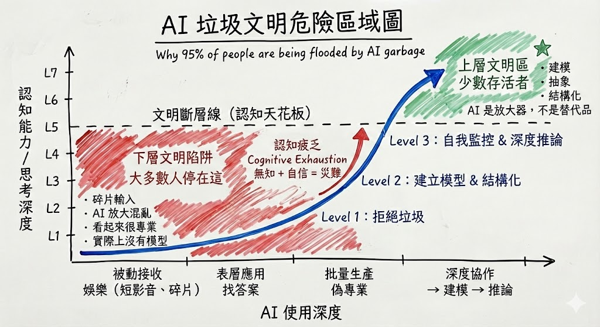

# ☣️ Protocol: The Civilization Fault Line (Cognitive Survival Map)
**Status:** Cognitive Safety | **Role:** Civilization Architect | **Objective:** Avoid the "AI Garbage Trap"

> "AI did not create the garbage; it simply amplified the human cognitive gap."

## 🗺️ The Hazard Map
This diagram maps the "Danger Zones" of AI usage. It distinguishes between those who are being drowned by AI and those who are surfing on top of it.

*(Fig 1. The Red Zone (Cognitive Exhaustion) vs. The Green Zone (Modeling & Abstraction))*

---

## 🛑 The Red Zone: Lower Civilization Trap (95% of People)
**Status:** `INFECTED` (Cognitive Exhaustion)
* **The Workflow:** Fragmented Input $\rightarrow$ AI Amplifies Chaos $\rightarrow$ Professional-Looking Pseudo-Content.
* **The Trap:** It creates the **Illusion of Competence**. You produce 10,000 words, but you understand nothing.
* **The Formula:** `Ignorance + Confidence = Disaster`.
* **The Biological Cost:** Your brain is receiving high-frequency noise. You feel productive, but your "Cognitive Energy" is being drained by filtering trash.

---

## 📉 The Dashed Line: The Civilization Fault Line
**Definition:** The Cognitive Ceiling.
* **The Rule:** No amount of AI content can save a human who lacks a **Mental Model**.
* Below the line: You are a "user" (consumed by the tool).
* Above the line: You are an "architect" (leveraging the tool).

---

## 🌲 The Green Zone: Upper Civilization Survivors (5%)
**Status:** `SECURE` (Deep Collaboration)
* **The Capability:** Modeling, Abstracting, Structuring.
* **The Mindset:** "AI is an amplifier, not a substitute."
* **The Workflow:**
    1.  **Modeling:** Draw the structure first.
    2.  **Prompting:** Ask AI to fill the specific gaps.
    3.  **Verification:** Check against the model.

---

## 🏹 The Path: The Blue Arrow (Escaping the Trap)
This is not a natural evolution; it is a deliberate choice to climb.

1.  **Level 1: Detox (Reject Garbage)**
    * Stop asking AI to "give me the answer."
    * Stop consuming fragmented short-form content.
2.  **Level 2: Structure (Build Muscle)**
    * Practice **Semantic Compression**. Can you summarize a complex topic into one model?
    * Force yourself to draw the "Logic Tree" before opening ChatGPT.
3.  **Level 3: Metacognition (Self-Monitoring)**
    * Build your own Knowledge System.
    * Know *exactly* when to use AI to amplify, and when to shut it off to think.

> **"The watershed moment is not which model you use, but whether you stand above the Civilization Fault Line."**

*Logged by Janet Yang*
*Civilization Risk Assessment - 2026*
