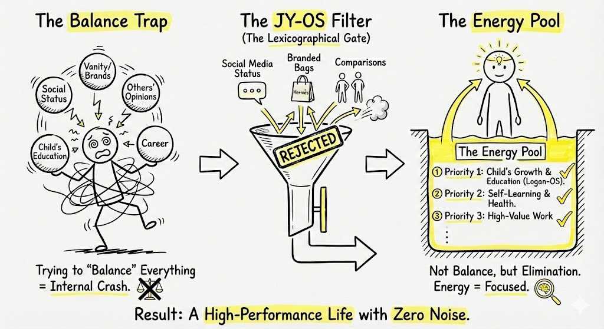

# ⚡ Protocol: The Energy Focus Protocol (Elimination > Balance)
**Status:** System Optimization | **Role:** Grid Manager | **Objective:** Zero Noise Throughput

> "You are not failing at balance. You are failing at elimination."

## 🔋 The Energy Schematic
This diagram contrasts "The Balance Trap" (Thrashing) with "The Energy Pool" (Focused Execution).

*(Fig 1. The Trap (Crash) $\rightarrow$ The Filter (Reject) $\rightarrow$ The Pool (Focus))*

---

## 💥 State 1: The Balance Trap (System Thrashing)
**The Bug:** Trying to "Balance" everything (Career, Image, Social Status, Kids, Opinions).
* **Engineering Reality:** This is **Context Switching Hell**.
* **The Result:** `Internal Crash`. You are not multitasking; you are "Thrashing"—spending all energy switching tasks with zero progress.
* **Symptoms:** High anxiety, dull complexion, constant fatigue.

---

## 🛡️ State 2: The JY-OS Filter (Lexicographical Gate)
**The Fix:** A strict "Reject" mechanism.
* **The Algorithm:** Lexicographical Ordering (Strict Priority).
* **The Rejections (Garbage Collection):**
    * Social Media Status 🚫
    * Branded Bags / Vanity 🚫
    * Other's Opinions 🚫
    * Comparisons 🚫
* **Rule:** "Does this task deserve my current battery level?" If no $\rightarrow$ **DROP.**

---

## 💡 State 3: The Energy Pool (Dedicated Threads)
**The Optimization:** Energy is concentrated, not distributed.
We only run **3 Main Threads**:
1.  **Priority 1:** Child's Growth & Education (Logan-OS).
2.  **Priority 2:** Self-Learning & Health (The Operator).
3.  **Priority 3:** High-Value Work (Strategy/AI).

**The "Glowing Forehead" Indicator:**
* When energy is focused, the system runs cool and efficient.
* This manifests physically as "Radiance" (The Glowing Forehead). It is not makeup; it is **System Efficiency**.

---

## 🎯 The Core Philosophy
**Not Balance, But Elimination.**
* **Balance** = Trying to keep all plates spinning (Stress).
* **Elimination** = Smashing the unimportant plates so you can hold the gold ones (Focus).

> **"Energy = Focused."**

*Logged by Janet Yang*
*Energy Grid Optimization - 2026*
