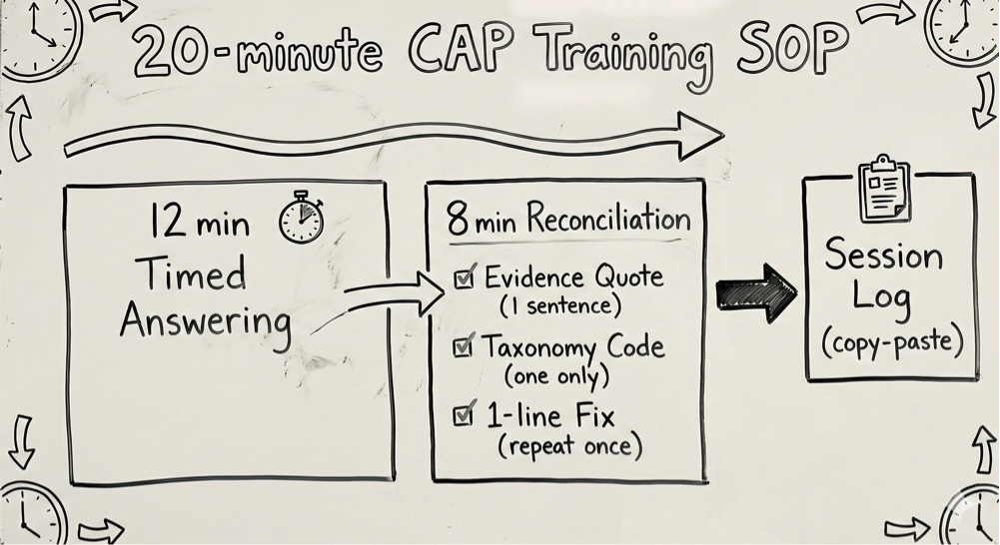
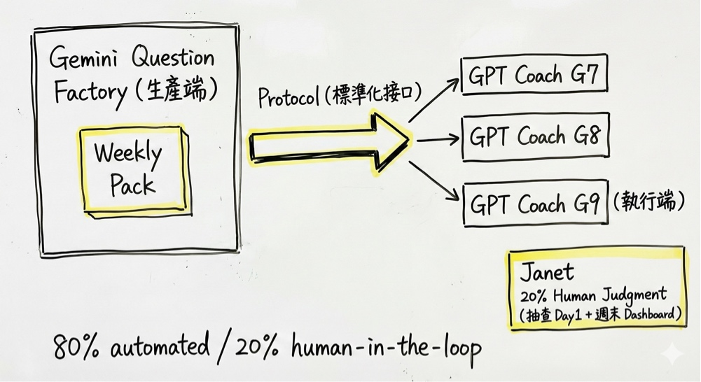
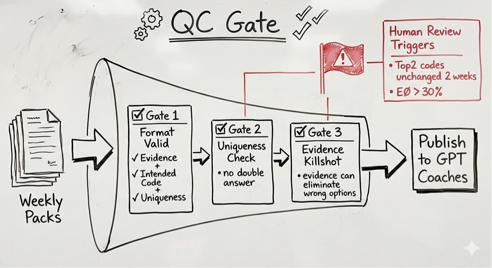
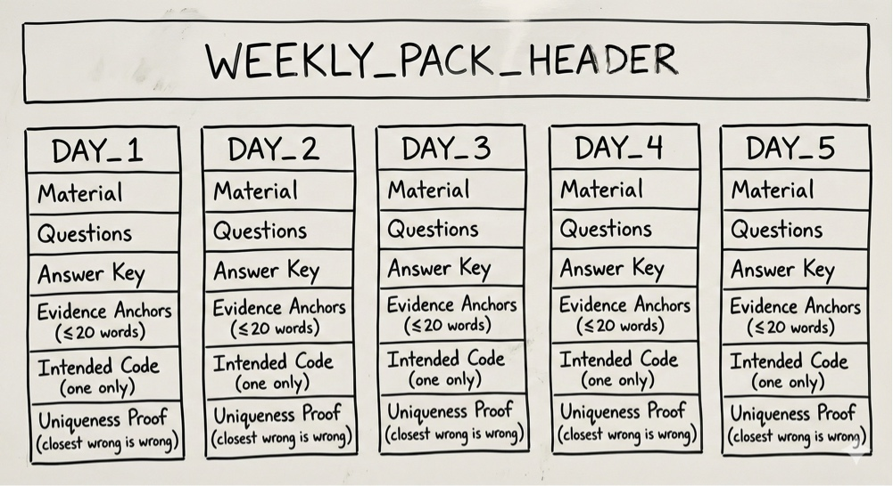

# 📖 Protocol: The CAP Reading Strategy (Evidence-Based Answering)
**Status:** Tactical Skill | **Role:** Exam Strategy | **Objective:** Stopping "Intuition Guessing"

> "Don't teach English. Reduce the friction of Evidence-Based Judgment."

## 📉 The Diagnosis: High Friction in Exams
**The Problem:** The child knows the words but picks the wrong answer.
* **Why:** They rely on "Intuition" (Feeling) instead of "Evidence" (Logic).
* **The Fix:** We apply **Protocol #39 (Logic Filters)** to English reading.
* **The Goal:** Shift from **"I feel like B is right"** to **"Line 4 says B is right."**

---

## ⏱️ The 20-Minute SOP (Daily Training)
**The Algorithm:** 12 Minutes Answering + 8 Minutes Reconciliation.
* **Phase 1 (12 min):** Timed pressure. Simulate real exam conditions.
* **Phase 2 (8 min):** Reconciliation (The Real Learning).
    * **Action 1:** Quote the Evidence (1 sentence from text).
    * **Action 2:** Log the Error Code (Taxonomy).
    * **Action 3:** 1-line Fix.
* **The Shift:** We don't just "Check Answers"; we "Audit the Logic."

---

## 🏭 The Production Factory (Content Generation)
**The System:** How we generate high-quality training data (Weekly Packs).
* **AI Role (80%):** Generates texts, questions, and evidence anchors using the `Gemini Question Factory` protocol.
* **Human Role (20%):** Audits for "Double Answers" or "Over-Inference."
* **Result:** A clean dataset where every question has a single, indisputable evidence line.

---

## 🛡️ The QC Gate (Quality Control)
**The Filter:** Why standard AI questions fail.
* **Gate 1:** Format Valid?
* **Gate 2:** Uniqueness Check (Is the wrong answer definitely wrong?).
* **Gate 3:** Evidence Killshot (Does one sentence kill all other options?).
* **Human Trigger:** If a student's error rate > 30% or error code remains static for 2 weeks, Human Review is triggered.

---

## 📊 The Weekly Pack Structure (The Interface)
**The Routine:** 5 Days a Week.
* **Consistency:** Same format every day.
* **Data Fields:** Question, Answer, Evidence Anchor (<20 words), Intended Code, Uniqueness Proof.
* **Goal:** Building a "Quality Loop," not just finishing homework.

---

## 🎯 The Core Philosophy
**It's not about "More Practice." It's about "Better Judgment."**
* Traditional: Do -> Check -> Listen to Teacher.
* **JY-OS:** Do -> Find Evidence -> Self-Correct.
* **Result:** The ability to say "The answer is B because Line 12 says X."

*Logged by Janet Yang*
*Exam Strategy Update - 2026*
