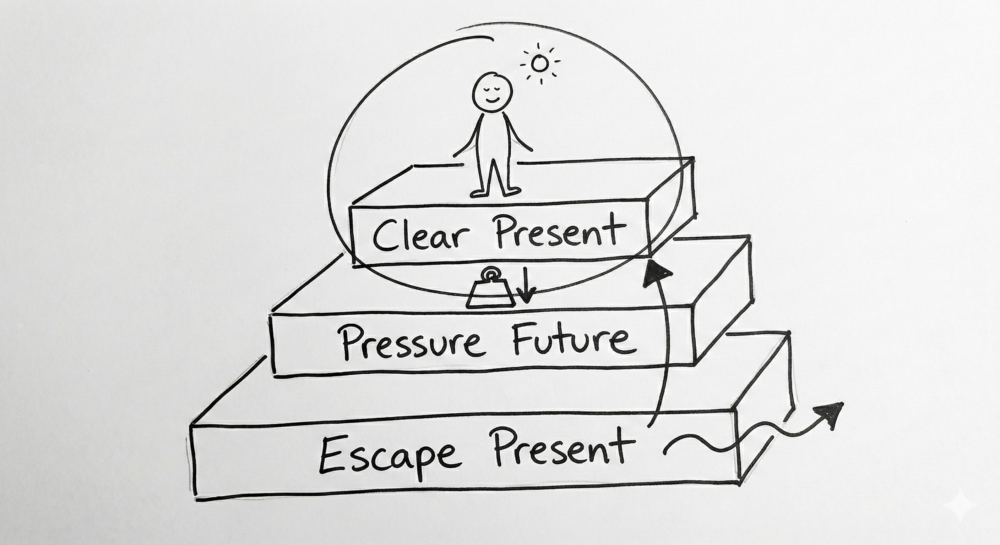
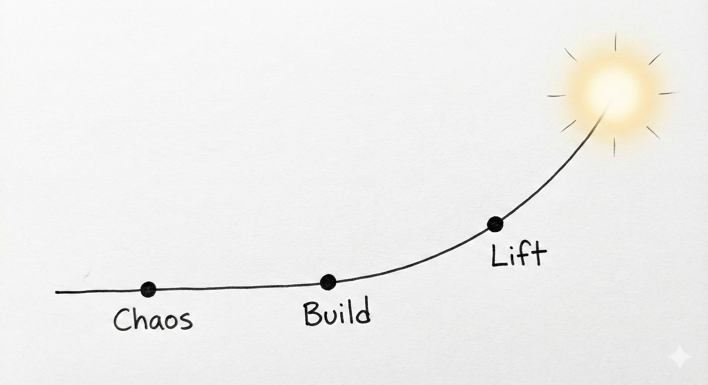
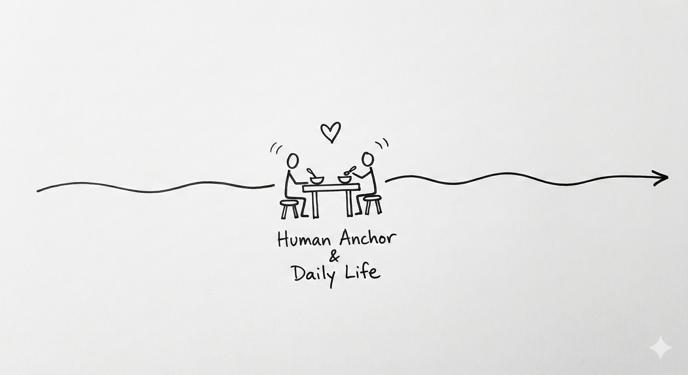
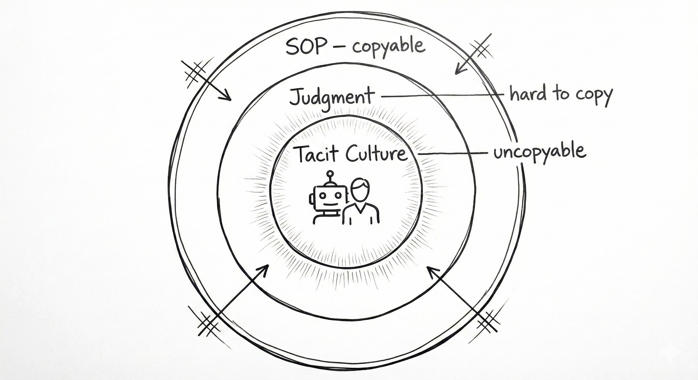
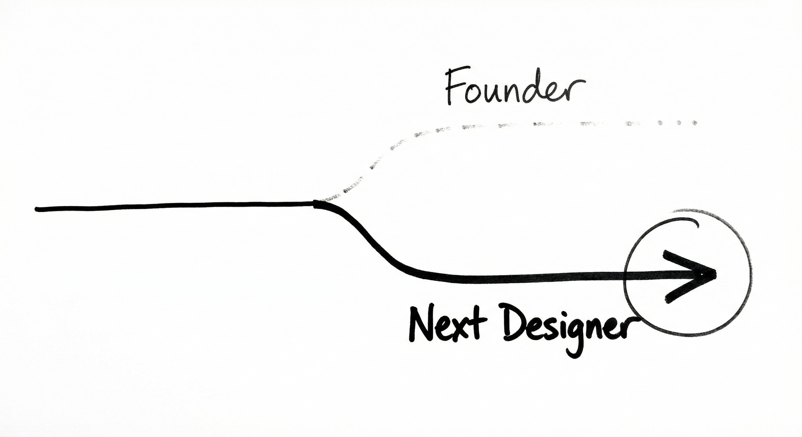
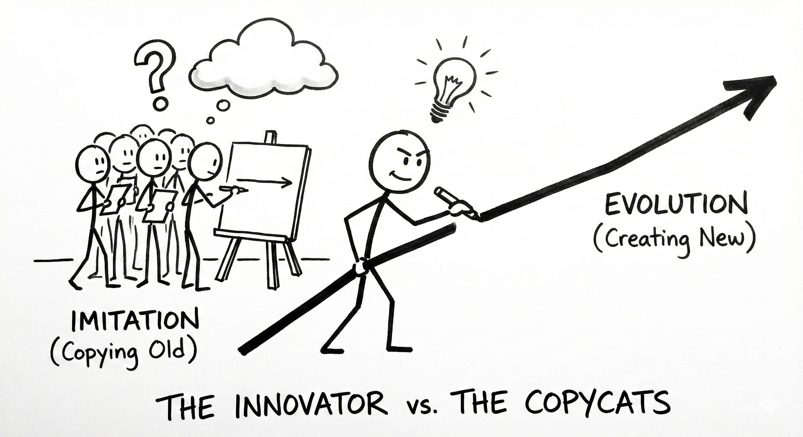
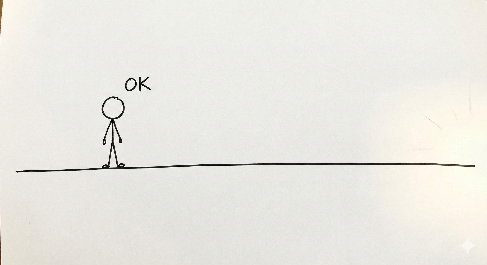

# 🔭 Protocol: The Founder's Mental Model (Long-Term Navigation)
**Status:** Core Philosophy | **Role:** Visionary | **Objective:** Moving from "Pressure" to "Meaning"

> "The complete 8-step architecture for a sustainable life system."

## 0. The Diagnosis: The Pressure Stack 🧱
**The Problem:** Why are we anxious?
* We stand on a **Clear Present**, but we are weighed down by a **Pressure Future**.
* Result: The system tries to **Escape Present**.
* **The Fix:** We need a new map (The J-Curve) to stop escaping and start building.

## 1. The Trajectory: Chaos $\rightarrow$ Build $\rightarrow$ Lift 📈
**The Reality:** Life is not linear; it is a J-Curve.
* Endure the flatline ("Build") to reach the exponential ("Lift").

## 2. The Anchor: Human Connection ⚓
**The Fuel:** High-performance requires deep recovery.
* A meal, a table, two people. This is not a distraction; it is the generator.

## 3. The Moat: Tacit Culture 🛡️
**The Defense:** * SOPs are copyable. Judgment is hard. **Culture is uncopyable.**

## 4. The Choice: Founder vs. Next Designer 🔀
**The Ego Check:** * Do you want to be "The Founder" (Ego) or "The Next Designer" (Evolution)?

## 5. The Lead: Innovator vs. Imitator ⚡
**The Mindset:** * Don't fight copycats. By the time they copy your line, you are drawing the next one.

## 6. The State: "OK" 🧘
**The Destination:** * A state of quiet alignment. No noise, just direction.

## 7. The Map: From Comfort to Meaning 🗺️
**The Overview:** * The full visual journey of the Founder's Life.

*Logged by Janet Yang*
*Founder's Log - Complete Architecture - 2026*
