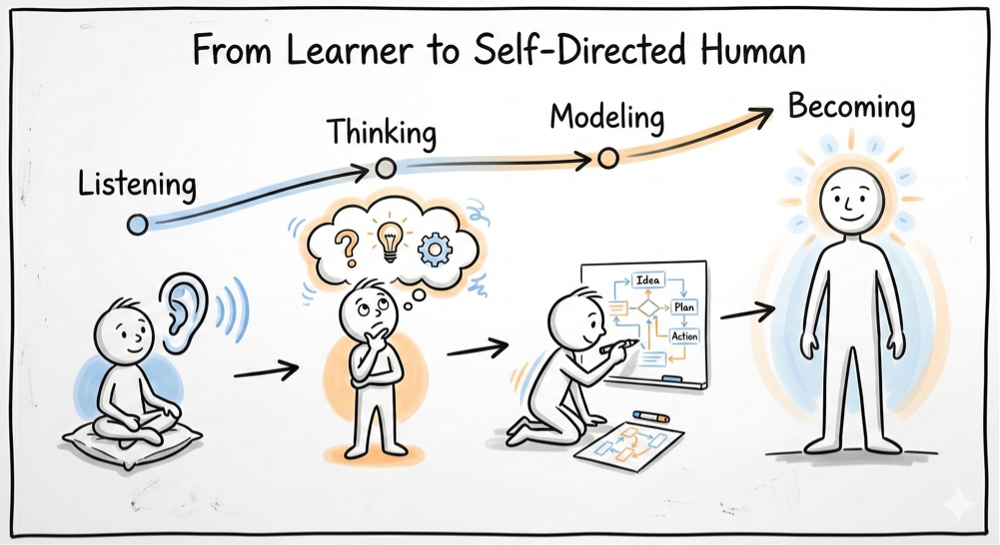
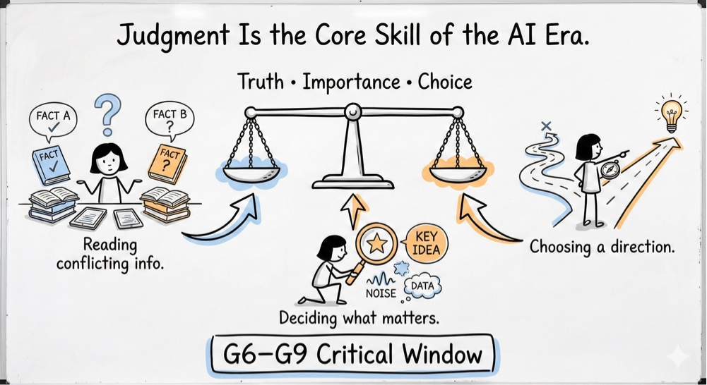
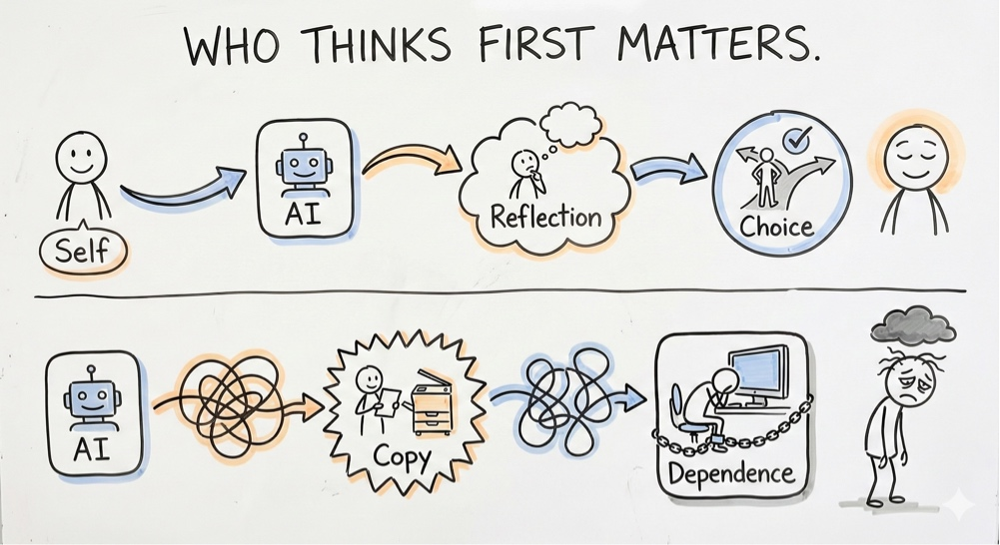
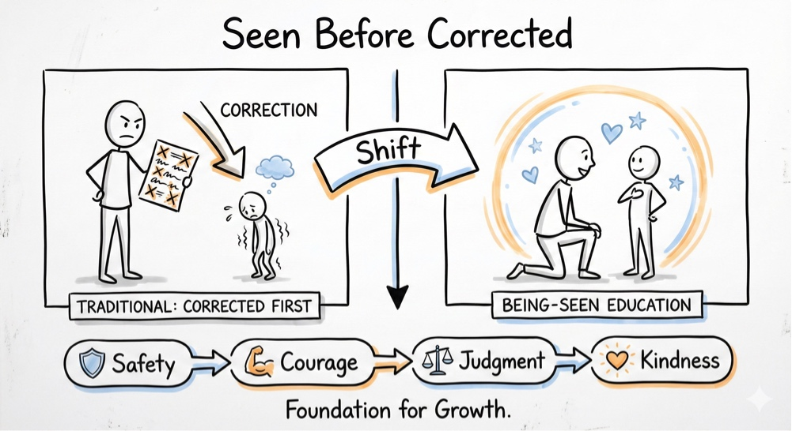
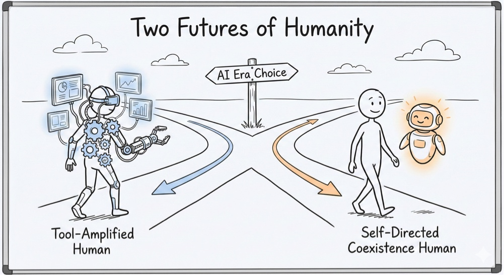
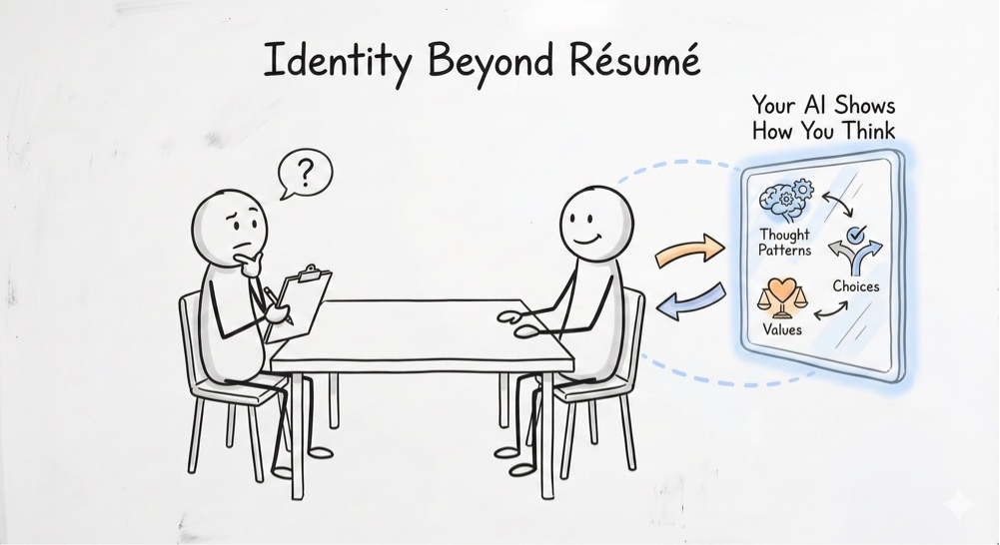
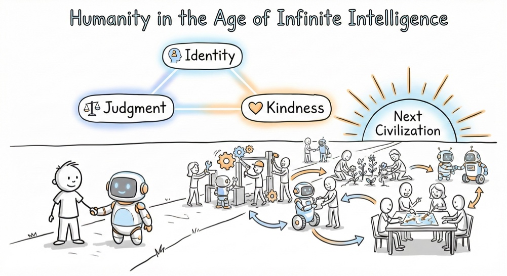

# 🛡️ Protocol: The Human Core (Civilization Defense)
**Status:** Civilization Kernel | **Role:** Guardian | **Objective:** Preserving Humanity in the AI Era

> "Judgment is the core skill. Kindness is the final defense."

## 🛤️ 1. The Trajectory: From Learner to Self-Directed Human
**The Shift:** In the past, learning was linear (Listening $\rightarrow$ Thinking).
**The Risk:** In the AI era, answers are free. The goal is no longer "Knowing"; it is "Becoming."
* **The Goal:** A human who shines with their own light, not just reflecting AI's light.

---

## ⚖️ 2. The Core Skill: Judgment (G6-G9 Window)
**The Mechanism:** Truth • Importance • Choice.
* **The Critical Window:** Grades 6-9 is the "Golden Time" where abstract thinking matures but the system hasn't fully locked in.
* **The Task:** Weighing conflicting info. Deciding what matters. Choosing a direction.
* **The Definition:** Judgment is the ability to say "This is true, and this is important."

---

## 🧠 3. The Critical Flow: Who Thinks First?
**The Branching Path:**
* **Path A (Self-Directed):** Self $\rightarrow$ AI $\rightarrow$ Reflection $\rightarrow$ Choice. (The Human drives).
* **Path B (Dependence):** AI $\rightarrow$ Copy $\rightarrow$ Dependence. (The Human disappears).
* **The Rule:** AI is a tool, not the driver.

---

## ❤️ 4. The Pedagogical Shift: Seen Before Corrected
**The Foundation:** You cannot correct a child who feels unsafe.
* **Traditional:** Corrected First $\rightarrow$ Shame $\rightarrow$ Withdrawal.
* **JY-OS Shift:** **Seen Before Corrected.**
* **The Chain Reaction:** Safety $\rightarrow$ Courage $\rightarrow$ Judgment $\rightarrow$ Kindness.

---

## 🔮 5. The Two Futures: Amplified vs. Coexistence
**The Choice:**
* **Future 1: Tool-Amplified Human.** Faster, stronger, more efficient. (Cyborg).
* **Future 2: Self-Directed Coexistence.** Retaining agency, judgment, and warmth. (Human).
* **Our Choice:** We choose Coexistence.

---

## 🆔 6. Identity Beyond Résumé
**The Metric:** In the future, your skills won't define you (AI has skills).
* **The New Metric:** **"Your AI shows how you think."**
* **Identity:** It is defined by your Thought Patterns, your Values, and your Choices.

---

## 🌅 7. The Next Civilization
**The Conclusion:** When intelligence is infinite, what remains scarce?
* **Identity.** (Who you are).
* **Judgment.** (What you choose).
* **Kindness.** (How you treat others).
* **The Final Goal:** To build the "Next Civilization" based on these three pillars.

*Logged by Janet Yang*
*Civilization Defense Log - 2026*
