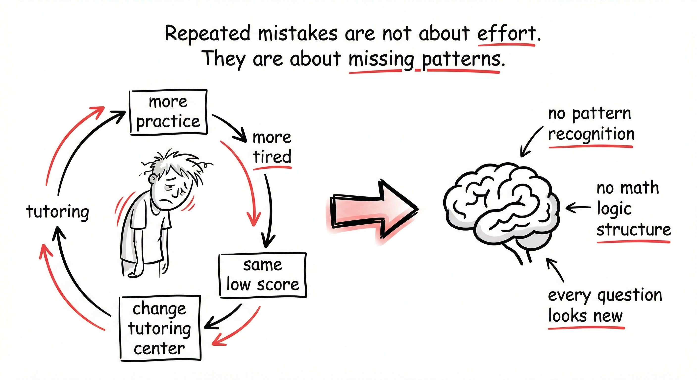
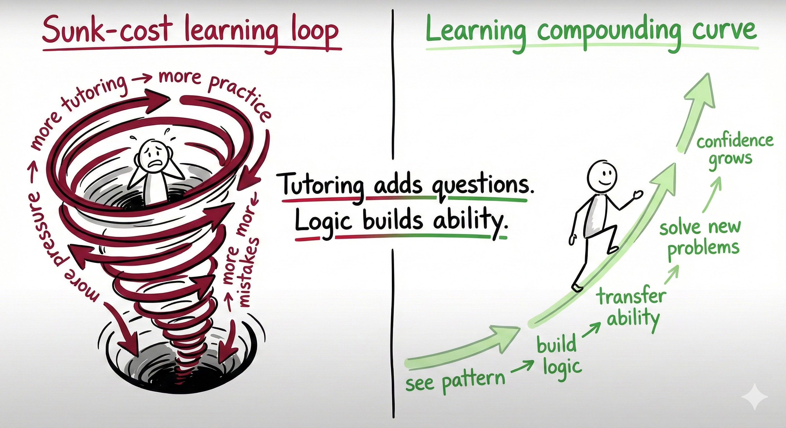
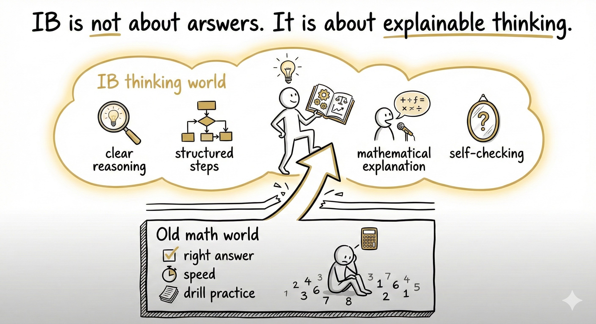

# 🧠 Protocol: The Learning Engine (Cognitive Reconstruction)
**Status:** Core Kernel | **Role:** Chief Learning Officer | **Objective:** From "Drilling" to "Structuring"

> "You don't fix scores. You rebuild the brain."

## 🧩 The 4 Pillars of Cognitive Architecture
This protocol defines the algorithms used by JY-OS to process academic data (Math, Logic, IB). We reject "Brute Force" (Drilling) and prioritize "Pattern Recognition."

---

## 1. Pattern Recognition (The Input Layer)
**The Bug:** Repeated mistakes.
* **Traditional Patch:** More practice + More Tutoring = "Sunk Cost Loop".
* **JY-OS Diagnosis:** The error is not in **Effort**; it is in **Missing Patterns**.
* **The Fix:** The child sees isolated problems. The OS must teach them to see the *Skeleton* (Structure) underneath the *Skin* (Numbers).

---

## 2. The Execution Stack (The Process Layer)
**The Bug:** "Calculate First." (Reflexive answering).
* **The Shift:** We insert a **"Pause Latency"** (Step 0) to force classification before computation.
* **The Algorithm:**
    * **Step 0 (Latency):** Pause. Identify the Question Type.
    * **Step 1 (Logic):** Find the Math Logic.
    * **Step 2 (Method):** Choose the Formula.
    * **Step 3 (Compute):** Calculate the answer.
* **Result:** Speed decreases initially, but accuracy and stability skyrocket.

---

## 3. The Compounding Curve (The Growth Layer)
**The Bug:** Linear Drilling (Tornado of Stress).
* **Visual:** "More Tutoring" leads to "More Pressure" and "Same Low Score."
* **The JY-OS Curve:**
    * Logic builds ability $\rightarrow$ Ability transfers to new problems $\rightarrow$ Confidence grows.
* **Metric:** We don't measure "Questions Completed." We measure "Patterns Mastered."

---

## 4. Explainable Thinking (The Output Layer)
**The Bug:** "Right Answer, Wrong Process."
* **Old World:** Speed + Accuracy = Success.
* **IB / AI World:** Explainable Thinking = Success.
* **The Requirement:**
    * Clear Reasoning.
    * Structured Steps.
    * Self-Checking Capability.
* **The Goal:** Not just getting the point, but being able to *teach* the logic.

---

## 🎯 The Core Philosophy
**Don't Ask: "Did you finish the homework?"**
**Ask: "Did you see the pattern?"**

* **Tutoring** adds questions.
* **Logic** builds ability.

*Logged by Janet Yang*
*Cognitive Kernel Update - 2026*
