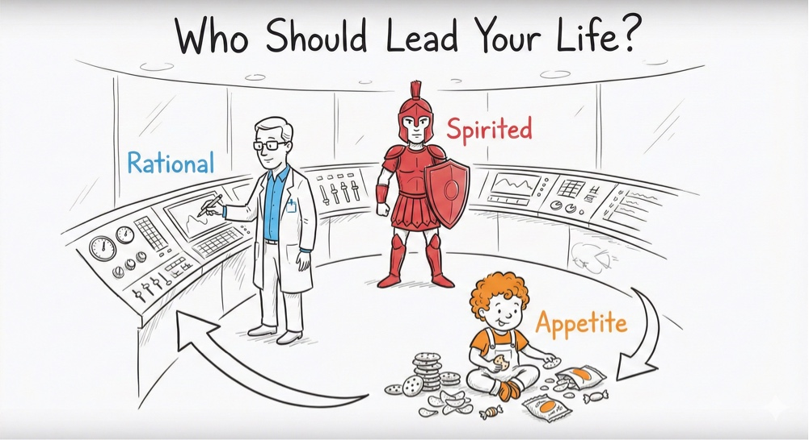
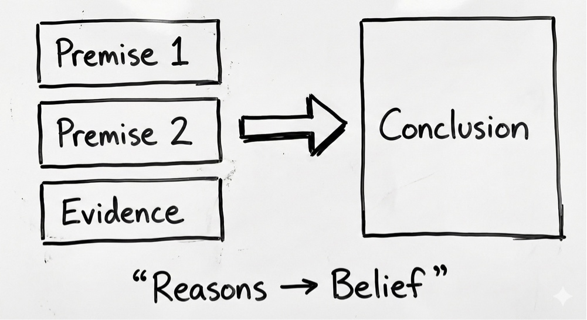
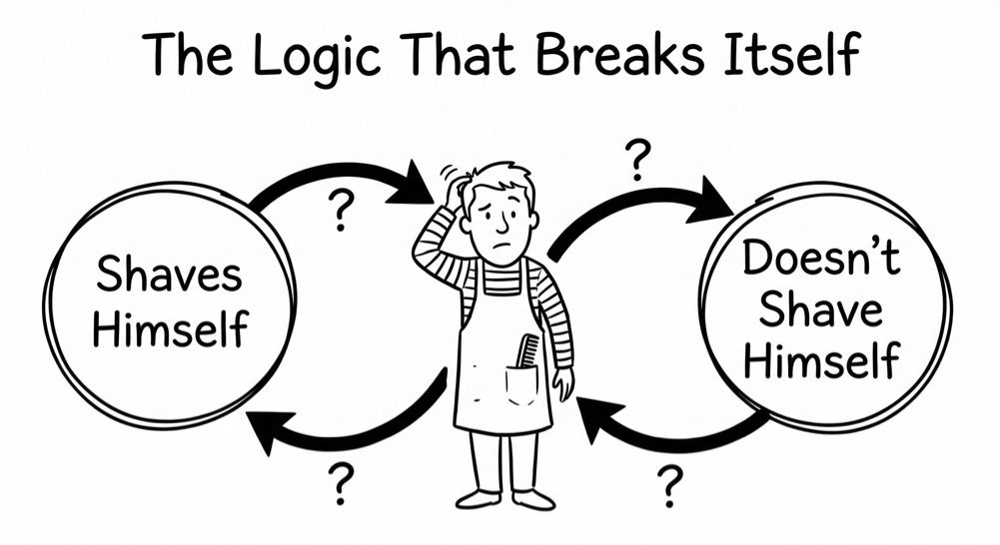
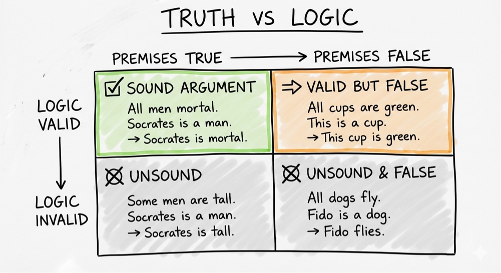
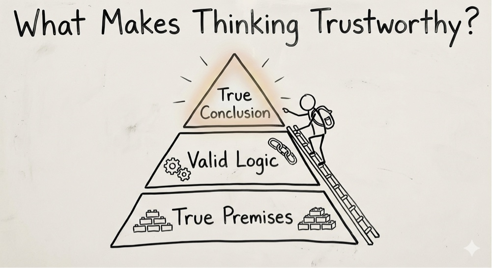

# 🧠 Protocol: The Logic Filters (Critical Thinking Architecture)
**Status:** Cognitive Kernel | **Role:** Truth Processor | **Objective:** Validating Reality

> "AI gives answers. Logic gives validity. Truth requires both."

## 🏛️ Filter 0: The Internal Control Room (Plato's Tripartite Soul)
**The Mechanism:** Who is driving the bus?
* **Rational (The Scientist):** Driven by facts. *Must be in charge.*
* **Spirited (The Soldier):** Driven by ego/honor. *Good servant, bad master.*
* **Appetitive (The Toddler):** Driven by desire. *Needs management.*
* **The Lesson:** Freedom is not doing what you want; it is Rationality controlling Desire.

---

## 🤖 Filter 1: Induction vs. Abduction (The Black Swan)
*(See previous section on Induction/Abduction)*
* **Induction:** Pattern Matching (AI's strength). Risk: Black Swan.
* **Abduction:** Best Explanation (Sherlock). Strength: Context.

---

## 🧩 Filter 2: The Logic Structure (Premise $\rightarrow$ Conclusion)
**The Mechanism:** Thinking is Engineering.
* **Input:** Premises (Evidence, Facts).
* **Process:** Valid Logic.
* **Output:** Conclusion (Belief).
* **The Rule:** If you have no Premises, you have no Argument. You just have an Opinion (Noise).

---

## ⚠️ Filter 3: The Paradox Check (The Barber)
**The Mechanism:** System Crash Test.
* **The Paradox:** "The barber shaves everyone who does not shave themselves." Does he shave himself?
* **The Lesson:** Sometimes the question itself is broken.
* **Critical Thinking:** The ability to spot a "Toxic Question" or a "System Error" before trying to answer it.

---

## ✅ Filter 4: Truth vs. Validity (The Matrix)
**The Mechanism:** How to spot a liar who makes sense.
* **Valid:** The structure is perfect. (e.g., "All cups are green. This is a cup. Therefore, it is green.") $\rightarrow$ *Logic is fine, but Reality is wrong.*
* **Sound:** The structure is valid AND the premises are true.
* **The Trap:** Smart people often have **Valid** logic but **False** premises. This is the most dangerous type of error.

---

## 🏆 Filter 5: The Trust Pyramid (Soundness)
**The Mechanism:** What makes thinking trustworthy?
* **Base:** True Premises.
* **Ladder:** Valid Logic.
* **Peak:** True Conclusion.
* **The AI Era Rule:** AI often generates **Valid** text (it reads well) based on **False** premises (Hallucination). Human verification must check the **Base**.

*Logged by Janet Yang*
*Logic Processor Upgrade - 2026*
