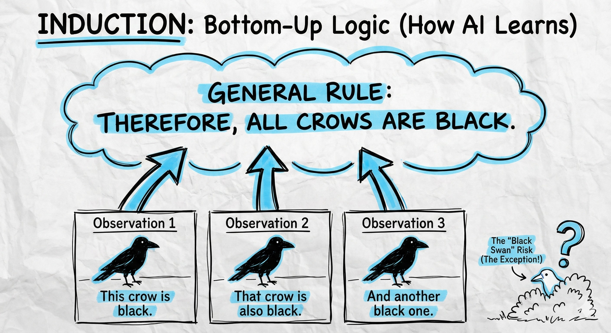
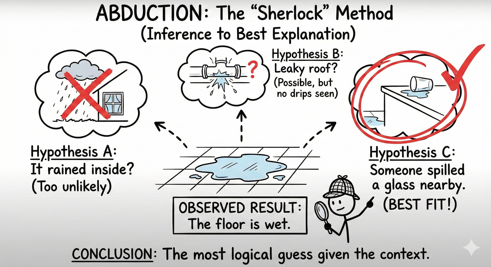

# 🧠 Protocol: The Logic Filters (Induction vs. Abduction)
**Status:** Cognitive Kernel | **Role:** Logic Processor | **Objective:** Truth Finding in the AI Era

> "AI provides the standard answer. Humans provide the Best Explanation."

## 🤖 Filter 1: Induction (Bottom-Up Logic)
**The Mechanism:** Observation $\rightarrow$ Pattern $\rightarrow$ General Rule.
* **The AI's Strength:** AI is a massive induction machine. It reads 1 billion crows and tells you "All crows are black."
* **The Trap:** The Black Swan.
* **The Lesson for Logan:** Use Induction to learn fast, but never trust it blindly. Just because the market went up 100 times doesn't mean it will go up the 101st time.

---

## 🕵️‍♂️ Filter 2: Abduction (The Sherlock Method)
**The Mechanism:** Result $\rightarrow$ Hypothesis $\rightarrow$ Best Explanation.
* **The Challenge:** "The floor is wet."
    * Hypothesis A: Roof leak? (Possible, but no drip).
    * Hypothesis B: Rain inside? (Impossible).
    * Hypothesis C: Spilled glass. (Best Fit).
* **The Human's Strength:** This requires **Context** and **Judgment**. AI often hallucinates here because it lacks physical context.
* **The Lesson for Logan:** This is the Analyst's core skill. Don't just read the data (Induction); tell me *why* the data happened (Abduction).

---

## 🎯 The Core Philosophy
**Don't be a Slogan Giant.**
Many kids (and adults) are trained to shout slogans ("Use AI!", "Be Ethical!").
But when asked "Why?" or "How?", they crash.

**The JY-OS Requirement:**
* Stop memorizing answers.
* Start verifying hypotheses.
* **Induction** helps you see patterns.
* **Abduction** helps you find the truth.

> **"In a world of generated content, the ability to discern the 'Best Explanation' is the ultimate competitive advantage."**

*Logged by Janet Yang*
*Logic Processor Update - 2026*
