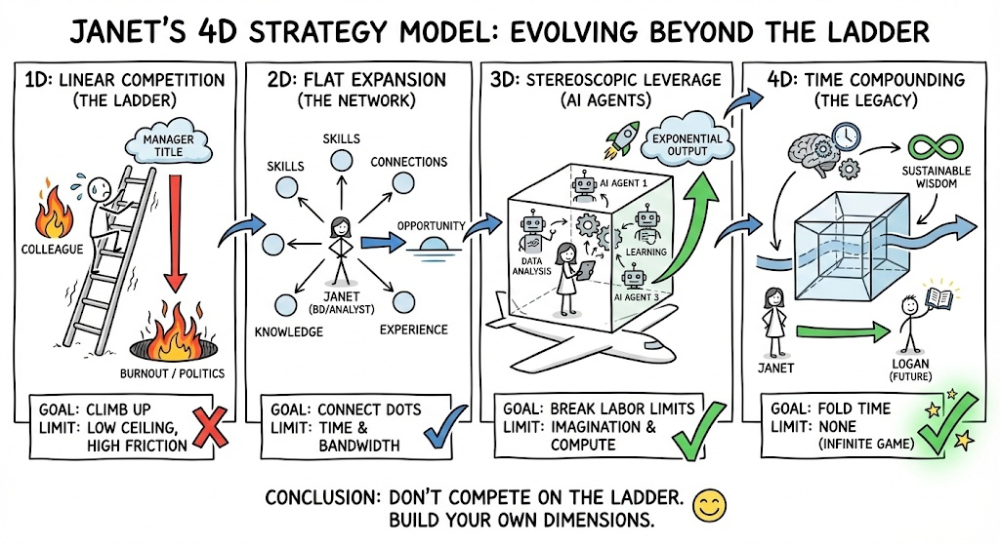

# 🚀 Protocol: The 4D Strategy Model (Career Engineering)
**Status:** Strategic Kernel | **Role:** Career Architect | **Objective:** Escaping Linear Competition

> "Don't compete on the ladder. Build your own dimensions."

## 📐 The 4 Dimensions of Professional Evolution
This model explains why "working harder" fails and how to engineer a career with leverage.

### 1D: Linear Competition (The Ladder) 🪜
* **The Game:** Climb higher, faster, beat others.
* **The Metric:** Job Title, Salary, Headcount.
* **The Trap:** High Friction, Low Ceiling, Burnout, Office Politics.
* **Status:** **Limited by Health & Endurance.**

### 2D: Flat Expansion (The Network) 🌐
* **The Game:** Connect skills, people, and knowledge.
* **The Metric:** Breadth, Opportunities, Reputation.
* **The Shift:** You stop looking "Up" and start looking "Around."
* **Status:** **Limited by Time (24h) & Bandwidth.**

### 3D: Stereoscopic Leverage (AI Agents) 📦
* **The Game:** Break the labor limit using Technology.
* **The Metric:** Output per Hour, System Efficiency.
* **The Tool:** AI Agents, Automation, Data Analysis.
* **Status:** **Exponential Output. Breaking the "One Person" limit.**

### 4D: Time Compounding (The Legacy) ⏳
* **The Game:** Create things that exist without you.
* **The Metric:** Sustainable Wisdom, Content, Systems, The Next Generation (Logan).
* **The Goal:** Infinite Game.
* **Status:** **Timeless. Your work lives on.**

---

## 🎯 The Core Philosophy
**It is not about "Quitting the Job." It is about "Stacking Dimensions."**
You can have a 1D Job (Salary), while building a 2D Network, deploying 3D AI Agents, and creating 4D Content.

**The Pivot:**
* **From:** "How high can I climb?"
* **To:** "What can I build that grows on its own?"

> **"Life is not a competition. It is a light that you leave behind."**

*Logged by Janet Yang*
*Strategic Dimension Update - 2026*
