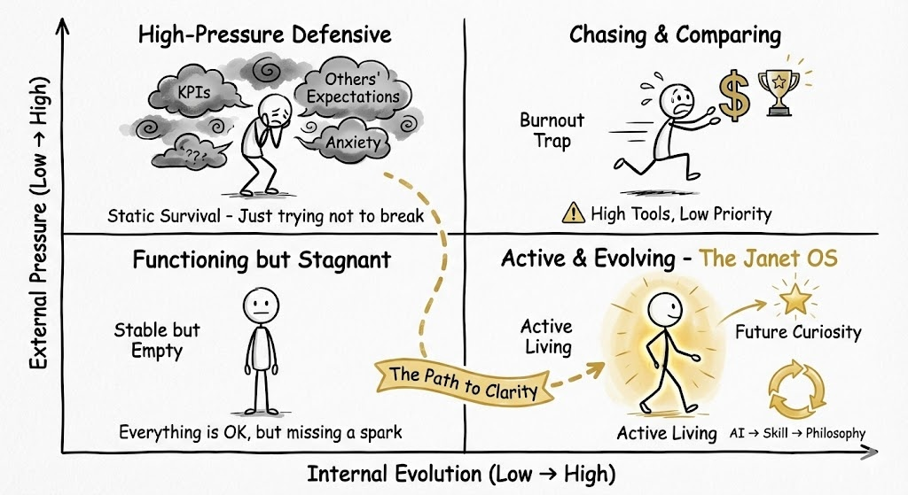

# 📊 Protocol: The System State Matrix (Life Quadrants)
**Status:** System Diagnostics | **Role:** Site Reliability Engineer (SRE) | **Objective:** Locating the Operating Mode

> "You cannot optimize what you cannot locate. Which quadrant are you running in?"

## 🗺️ The Operating Dashboard
This diagram categorizes the four common states of a human operating system based on **Pressure** vs. **Evolution**.

*(Fig 1. Y-Axis: External Pressure. X-Axis: Internal Evolution.)*

---

## 🛑 Quadrant 1: High-Pressure Defensive (Top-Left)
**Status:** `CRITICAL` (Static Survival)
* **The Symptoms:** Anxiety, KPIs, Meeting Expectations.
* **The Engineering View:** System is under constant **DDoS Attack**.
* **Resource Usage:** 100% CPU is used for "Firewall Defense" (Not breaking). 0% is used for "Upgrades."
* **Result:** You are busy, but you are not moving.

## ⚠️ Quadrant 2: Chasing & Comparing (Top-Right)
**Status:** `OVERCLOCKING` (Burnout Trap)
* **The Symptoms:** High achievement, accumulation of tools/money, hidden exhaustion.
* **The Engineering View:** **High Output, Low Priority Queue.** You are processing tasks faster, but the tasks are low-value (comparison).
* **Result:** Hardware failure (Burnout).

## 💤 Quadrant 3: Functioning but Stagnant (Bottom-Left)
**Status:** `IDLE` (Stable but Empty)
* **The Symptoms:** Job is fine, Family is fine, "Everything is OK."
* **The Engineering View:** **Legacy System.** It works, but it hasn't been patched in years. It lacks the "Spark" (Innovation).
* **Result:** Gradual obsolescence.

## ✨ Quadrant 4: Active & Evolving (Bottom-Right)
**Status:** `AGILE` (The Janet OS)
* **The Symptoms:** Curiosity, Learning, "Small Stars in the Eyes."
* **The Engineering View:** **Continuous Deployment (CI/CD).**
* **The Logic:** Internal Evolution Speed > External Consumption Speed.
* **The Cycle:** AI Conversation $\rightarrow$ Skill Update $\rightarrow$ Philosophy Reflection.

---

## 🛤️ The Path to Clarity
How do we move to Quadrant 4?
It is not a jump; it is a migration path (The Dotted Line).
1.  **Stop Ingesting:** Reduce the "External Pressure" (Use Protocol #29 Stoic Filter).
2.  **Start Versioning:** Create an update mechanism (Use Protocol #30 Iteration Spiral).
3.  **Invest:** Reallocate resources to "Non-negotiables" (Use Protocol #31 Purple Dye).

**The Diagnostic Question:**
> **"If I change nothing, how long will I remain in this box?"**

*Logged by Janet Yang*
*System Diagnostic Report - 2026*
