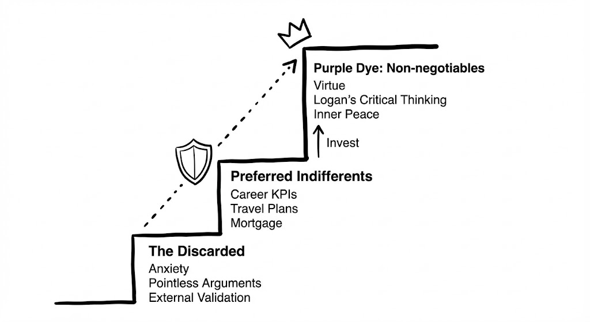

# 💎 Protocol: The Purple Dye (Value Hierarchy Protection)
**Status:** System Integrity | **Role:** Resource Auditor | **Objective:** Preventing Illegal Transactions

> "You are not cashing out. You are fading out."

## 🏛️ The Value Stack
This diagram illustrates the non-negotiable hierarchy of system resources.

*(Fig 1. The Discarded $\rightarrow$ Preferred Indifferents $\rightarrow$ Non-negotiables)*

---

## 🗑️ Layer 1: The Discarded (Garbage Collection)
**Status:** `DELETE`
* **Content:** Anxiety, Pointless Arguments, External Validation.
* **Engineering Action:** These processes consume CPU but generate zero output.
* **Rule:** They must be aggressively garbage-collected. Do not optimize them; delete them.

---

## 💼 Layer 2: Preferred Indifferents (User Space)
**Status:** `INVEST` (But do not `LOCK`)
* **Content:** Career KPIs, Travel Plans, Mortgage, Wealth.
* **Definition:** These are "Nice to haves." They make the system run smoother.
* **The Trap:** Most system crashes happen here. Not because we fail to achieve them, but because we **overpay** for them.
* **Rule:** You can invest time here, but you cannot trade Layer 3 assets for this.

---

## 👑 Layer 3: The Purple Dye (Kernel Space / Root)
**Status:** `NON-NEGOTIABLE`
* **Content:** Virtue, Critical Thinking (Logan), Inner Peace.
* **The Metaphor:** In antiquity, Tyrian Purple dye was so rare that once wool was dyed, it could never be washed out. It changed the nature of the material.
* **The Shield:** The icon in the diagram represents the **Write Protection**.
* **The Fatal Error:** Trading Layer 3 to buy Layer 2.
    * *Example:* Sacrificing a relationship (Layer 3) to hit a Q4 KPI (Layer 2).
    * *Result:* This is an "Illegal Transaction." You didn't just "win" the KPI; you permanently degraded the system's integrity.

---

## 🎯 The Core Philosophy
**It is not about Direction; it is about Updates.**
"Where are you going?" is the wrong question.
"What are you exchanging?" is the right question.

**The Audit Question:**
* Look at your last stressful event.
* Did you pay with "Purple Dye" (Character/Health) to buy "Indifferents" (Validation/Money)?
* If yes, the system is compromised. Restore from backup immediately.

> **"I update myself every day to ensure the Purple Dye remains undiluted."**

*Logged by Janet Yang*
*System Integrity Check - 2026*
